# Claude Code CLI -- Structure Extraction

> Source: `C:\Users\alfio\Downloads\aaa\src` (~1902 files)
> Analysis date: 2026-04-04

---

## 1. Top-Level File Inventory

The root `src/` contains both standalone modules and entry-wiring files:

| File | Purpose |
|------|---------|
| `main.tsx` | Commander CLI definition, arg parsing, session setup, launches REPL |
| `query.ts` | The agent loop -- streams model responses, runs tools, handles compaction |
| `QueryEngine.ts` | SDK-facing query engine -- wraps query.ts for non-interactive/SDK use |
| `Tool.ts` | `Tool<Input, Output, Progress>` interface + `ToolUseContext` mega-type |
| `tools.ts` | Tool registry -- `getTools()` assembles the full tool list |
| `commands.ts` | Command registry -- `getCommands()` assembles all slash commands |
| `context.ts` | `getUserContext()` / `getSystemContext()` -- git status, CLAUDE.md, date |
| `cost-tracker.ts` | Token/cost accounting per model |
| `costHook.ts` | React hook for cost display |
| `history.ts` | Prompt history (up-arrow recall) |
| `ink.ts` | Re-exports from the custom Ink fork (terminal React renderer) |
| `tasks.ts` | Task system orchestration |
| `setup.ts` | First-run setup flow |
| `replLauncher.tsx` | Launches `App > REPL` into the Ink render tree |
| `interactiveHelpers.tsx` | Trust dialogs, setup screens, renderAndRun |
| `dialogLaunchers.tsx` | Lazy-import launchers for modal dialogs |
| `projectOnboardingState.ts` | Tracks onboarding state per project |

---

## 2. Directory Map

### 2.1 `entrypoints/` -- Binary Entry Points

| File | Role |
|------|------|
| `cli.tsx` | Main CLI entrypoint -- fast-path for `--version`, then delegates to `main.tsx` |
| `init.ts` | Bootstraps configs, proxy, mTLS, telemetry, OAuth, cleanup handlers |
| `mcp.ts` | MCP server mode -- exposes tools via MCP protocol over stdio |
| `agentSdkTypes.ts` | Public SDK type definitions + stub functions (`query()`, `listSessions()`, etc.) |
| `sdk/` | SDK sub-types: `coreTypes.ts` (serializable), `coreSchemas.ts` (Zod), `controlSchemas.ts` |

**Boot sequence**: `cli.tsx` -> `init.ts` -> `main.tsx` -> `replLauncher.tsx` -> `App.tsx` -> `REPL.tsx`

### 2.2 `constants/` -- Prompts, Limits, Configuration Constants

| File | Role |
|------|------|
| `prompts.ts` | **System prompt assembly** -- `getSystemPrompt()` builds the full prompt from sections |
| `systemPromptSections.ts` | Memoized section system -- `systemPromptSection()`, `DANGEROUS_uncachedSystemPromptSection()` |
| `tools.ts` | Tool name sets: `ALL_AGENT_DISALLOWED_TOOLS`, `ASYNC_AGENT_ALLOWED_TOOLS`, etc. |
| `common.ts` | Session start date, local ISO date |
| `system.ts` | CLI system prompt prefix, attribution header |
| `outputStyles.ts` | Output style config (verbose, concise, etc.) |
| `apiLimits.ts` | API rate/token limits |
| `toolLimits.ts` | Per-tool size limits |
| `betas.ts` | Beta feature flags |
| `keys.ts` | Keyboard shortcut constants |
| `messages.ts` | Reusable message templates |
| `xml.ts` | XML tag constants (`TICK_TAG`, `LOCAL_COMMAND_STDOUT_TAG`, etc.) |
| `oauth.ts` | OAuth config |
| `product.ts` | Product name, URLs |
| `figures.ts` | Unicode figure characters |
| `files.ts` | File path constants |
| `errorIds.ts` | Error identification codes |
| `cyberRiskInstruction.ts` | Cyber risk prompt section |
| `spinnerVerbs.ts` | Spinner animation verbs |
| `turnCompletionVerbs.ts` | Turn completion display verbs |

### 2.3 `coordinator/` -- Coordinator Mode (Experimental)

Single file: `coordinatorMode.ts`

- `isCoordinatorMode()` -- checks `CLAUDE_CODE_COORDINATOR_MODE` env var
- `matchSessionMode()` -- flips env var to match resumed session's mode
- `getCoordinatorUserContext()` -- builds prompt section listing worker tools + MCP servers + scratchpad

### 2.4 `context/` -- React Contexts

| File | Role |
|------|------|
| `QueuedMessageContext.tsx` | Queued message state for deferred user messages |
| `fpsMetrics.tsx` | FPS performance tracking context |
| `mailbox.tsx` | Inter-component message passing (swarm workers, teammates) |
| `modalContext.tsx` | Modal dialog state management |
| `notifications.tsx` | Notification system context |
| `overlayContext.tsx` | Overlay UI state |
| `promptOverlayContext.tsx` | Prompt overlay context |
| `stats.tsx` | Stats store context |
| `voice.tsx` | Voice mode context |

### 2.5 `commands/` -- Slash Command System

~100+ command directories, each with an `index.ts` or `.ts` entrypoint. Registered in `commands.ts`.

**Command categories:**

| Category | Examples |
|----------|----------|
| Session | `clear`, `compact`, `resume`, `session`, `exit` |
| Git | `commit`, `commit-push-pr`, `diff`, `branch` |
| File/Context | `add-dir`, `context`, `copy`, `export`, `files` |
| Config | `config`, `env`, `theme`, `keybindings`, `permissions`, `output-style` |
| Debug | `doctor`, `debug-tool-call`, `heapdump`, `perf-issue`, `ctx_viz` |
| Model | `model`, `effort`, `fast` |
| Remote | `bridge`, `remote-env`, `remote-setup`, `teleport` |
| MCP | `mcp` (add/remove/list servers) |
| Info | `help`, `version`, `status`, `cost`, `usage`, `stats` |
| Skills | `skills`, `plugin`, `reload-plugins` |
| Memory | `memory` |
| Review | `review`, `security-review` |
| Tasks | `tasks` |
| Voice | `voice` |
| vim | `vim` |

**Command type union** (from `types/command.ts`):
- `LocalCommand` -- runs locally, returns text/compact/skip
- `PromptCommand` -- injects content into the model conversation
- `LocalJSXCommand` -- renders React/Ink UI

### 2.6 `tools/` -- Tool Definitions

Each tool is a directory with a main `.tsx`/`.ts` file implementing the `Tool` interface.

| Tool | Purpose |
|------|---------|
| `BashTool` | Shell command execution (with permission checks, security, path validation) |
| `FileReadTool` | Read files |
| `FileEditTool` | Edit files (search-and-replace) |
| `FileWriteTool` | Create/overwrite files |
| `GlobTool` | File pattern matching |
| `GrepTool` | Content search |
| `AgentTool` | Spawn sub-agents (with color management, memory, fork support) |
| `AskUserQuestionTool` | Ask user for input |
| `WebFetchTool` | HTTP fetch |
| `WebSearchTool` | Web search |
| `NotebookEditTool` | Jupyter notebook editing |
| `SkillTool` | Invoke skills |
| `ToolSearchTool` | Search for deferred tools |
| `TodoWriteTool` | Write to todo list |
| `TaskCreateTool` / `TaskGetTool` / `TaskListTool` / `TaskUpdateTool` / `TaskStopTool` / `TaskOutputTool` | Task management |
| `TeamCreateTool` / `TeamDeleteTool` | Agent team management |
| `SendMessageTool` | Send messages to teammates |
| `EnterPlanModeTool` / `ExitPlanModeTool` | Plan mode toggle |
| `EnterWorktreeTool` / `ExitWorktreeTool` | Git worktree management |
| `ConfigTool` | Read/write config |
| `LSPTool` | Language Server Protocol integration |
| `MCPTool` | MCP tool proxy |
| `ListMcpResourcesTool` / `ReadMcpResourceTool` | MCP resource access |
| `SyntheticOutputTool` | Synthetic output for SDK |
| `ScheduleCronTool` | Cron scheduling |
| `RemoteTriggerTool` | Remote trigger |
| `SleepTool` | Sleep/wait |
| `BriefTool` | Brief mode |
| `REPLTool` | REPL mode (ant-only) |
| `PowerShellTool` | PowerShell (Windows) |

`tools/shared/` contains:
- `gitOperationTracking.ts` -- tracks git operations
- `spawnMultiAgent.ts` -- multi-agent spawning

### 2.7 `services/` -- Backend Services

| Directory | Purpose |
|-----------|---------|
| `api/` | Anthropic API client (`claude.ts`), streaming, retry, logging, errors |
| `compact/` | Compaction system -- `compact.ts`, `autoCompact.ts`, `microCompact.ts`, `grouping.ts` |
| `mcp/` | MCP server management, config parsing, auth, in-process transport |
| `tools/` | Tool orchestration -- `toolOrchestration.ts`, `toolExecution.ts`, `StreamingToolExecutor.ts` |
| `analytics/` | GrowthBook, telemetry, event logging |
| `oauth/` | OAuth client |
| `plugins/` | Plugin management |
| `policyLimits/` | Enterprise policy limits |
| `remoteManagedSettings/` | Remote settings sync |
| `extractMemories/` | Memory extraction from conversations |
| `SessionMemory/` | Session memory management |
| `AgentSummary/` | Agent summary generation |
| `PromptSuggestion/` | Prompt suggestion service |
| `tips/` | Tip registry |
| `lsp/` | LSP integration |
| `tokenEstimation.ts` | Token counting |
| `toolUseSummary/` | Tool use summary generation |
| `voice.ts` | Voice transcription |

### 2.8 `components/` -- React/Ink UI Components

Major component groups:

- **Core UI**: `App.tsx`, `Messages.tsx`, `Message.tsx`, `MessageRow.tsx`, `PromptInput/`
- **Permissions**: `permissions/PermissionRequest.tsx`, `permissions/WorkerPendingPermission.tsx`
- **Dialogs**: `CostThresholdDialog.tsx`, `IdleReturnDialog.tsx`, `ExportDialog.tsx`, `BridgeDialog.tsx`, etc.
- **Tools UI**: `FileEditToolDiff.tsx`, `StructuredDiff.tsx`, `ToolUseLoader.tsx`
- **Status**: `StatusLine.tsx`, `StatusNotices.tsx`, `Spinner.tsx`, `SpinnerWithVerb`
- **Settings**: `Settings/`, `ThemePicker.tsx`, `ModelPicker.tsx`, `OutputStylePicker.tsx`
- **MCP**: `mcp/ElicitationDialog.tsx`, `MCPServerApprovalDialog.tsx`
- **Teams**: `teams/`, `CoordinatorAgentStatus.tsx`, `TeammateViewHeader.tsx`
- **Tasks**: `tasks/`, `TaskListV2.tsx`
- **Markdown**: `Markdown.tsx`, `MarkdownTable.tsx`
- **Design System**: `design-system/`, `ui/`
- **Memory**: `memory/`, `MemoryUsageIndicator.tsx`
- **Agents**: `agents/`
- **Skills**: `skills/`

### 2.9 `ink/` -- Custom Ink Fork (Terminal Renderer)

A heavily customized fork of Ink (React renderer for terminals).

| File/Dir | Purpose |
|----------|---------|
| `ink.tsx` | Main Ink render function |
| `reconciler.ts` | React reconciler for terminal |
| `renderer.ts` | Core rendering pipeline |
| `output.ts` | Output buffer management |
| `screen.ts` | Screen management |
| `terminal.ts` | Terminal abstraction |
| `dom.ts` | Virtual DOM for terminal nodes |
| `layout/` | Layout engine (Yoga-based) |
| `components/` | Built-in Ink components (Box, Text, etc.) |
| `hooks/` | Ink hooks (useInput, useStdin, useFocus, etc.) |
| `events/` | Terminal event handling |
| `termio/` | Low-level terminal I/O |
| `stringWidth.ts` | ANSI-aware string width calculation |
| `colorize.ts` | ANSI color helpers |
| `searchHighlight.ts` | Search highlighting |
| `selection.ts` | Text selection |
| `wrapAnsi.ts` | ANSI-safe text wrapping |

### 2.10 `cli/` -- CLI Transport Layer

| File | Purpose |
|------|---------|
| `handlers/` | Auth, auto-mode, MCP, plugins, agents handlers |
| `transports/` | `WebSocketTransport.ts`, `SSETransport.ts`, `HybridTransport.ts` -- for remote sessions |
| `structuredIO.ts` | Structured I/O for SDK/non-interactive mode (JSON-lines over stdin/stdout) |
| `remoteIO.ts` | Remote I/O wrapper |
| `print.ts` | Print mode output |
| `exit.ts` | Exit handling |
| `update.ts` | Auto-update logic |
| `ndjsonSafeStringify.ts` | Safe NDJSON serialization |

### 2.11 `bridge/` -- Remote Session Management

Handles "Remote Control" -- claude.ai web UI controlling a local Claude Code instance.

| File | Purpose |
|------|---------|
| `bridgeMain.ts` | Main bridge entry point |
| `bridgeApi.ts` | API for environments/sessions |
| `bridgeConfig.ts` | Bridge configuration |
| `bridgeMessaging.ts` | WebSocket message protocol |
| `bridgePermissionCallbacks.ts` | Permission prompting over bridge |
| `bridgeUI.ts` | Bridge UI components |
| `replBridge.ts` / `replBridgeHandle.ts` | REPL-mode bridge integration |
| `sessionRunner.ts` | Session lifecycle over bridge |
| `types.ts` | Protocol types (WorkData, WorkSecret, SpawnMode, etc.) |
| `jwtUtils.ts` | JWT handling |
| `inboundMessages.ts` / `inboundAttachments.ts` | Incoming message handling |

### 2.12 `hooks/` -- React Hooks

~80+ hooks. Key ones:

| Hook | Purpose |
|------|---------|
| `useCanUseTool.tsx` | Permission checking for tool use |
| `useCommandKeybindings.tsx` | Command keyboard shortcuts |
| `useGlobalKeybindings.tsx` | Global keyboard shortcuts |
| `useSettingsChange.ts` | Settings file watcher |
| `useRemoteSession.ts` | Remote session management |
| `useAssistantHistory.ts` | Conversation history |
| `useInputBuffer.ts` | Input buffer management |
| `useVirtualScroll.ts` | Virtual scrolling for messages |
| `useTextInput.ts` | Text input handling |
| `useDiffData.ts` | Diff computation |
| `useMergedTools.ts` | Tool merging (built-in + MCP + plugins) |
| `useMergedCommands.ts` | Command merging |
| `useSwarmInitialization.ts` | Agent swarm setup |
| `useTasksV2.ts` | Task system hooks |

### 2.13 `keybindings/` -- Key Binding System

| File | Purpose |
|------|---------|
| `defaultBindings.ts` | Default key mappings |
| `loadUserBindings.ts` | User keybindings.json loader |
| `KeybindingContext.tsx` | React context for keybindings |
| `KeybindingProviderSetup.tsx` | Provider setup component |
| `parser.ts` | Key sequence parser |
| `match.ts` | Key matching logic |
| `resolver.ts` | Binding resolution |
| `schema.ts` | Keybinding schema |
| `reservedShortcuts.ts` | Non-overridable shortcuts (ctrl+c, ctrl+d) |
| `template.ts` | Keybinding template generation |
| `validate.ts` | Binding validation |

### 2.14 `memdir/` -- Memory System

| File | Purpose |
|------|---------|
| `memdir.ts` | Core memory logic -- `loadMemoryPrompt()`, MEMORY.md handling |
| `findRelevantMemories.ts` | Memory retrieval |
| `memoryScan.ts` | Memory file scanning |
| `memoryAge.ts` | Memory age tracking |
| `memoryTypes.ts` | Memory type definitions and prompt templates |
| `paths.ts` | Memory file paths |
| `teamMemPaths.ts` | Team memory paths |
| `teamMemPrompts.ts` | Team memory prompts |

### 2.15 `state/` -- Application State

| File | Purpose |
|------|---------|
| `AppState.tsx` | React context provider + `AppStateProvider` component |
| `AppStateStore.ts` | `AppState` type definition + `getDefaultAppState()` |
| `store.ts` | Generic store implementation (external sync store) |
| `selectors.ts` | State selectors |
| `onChangeAppState.ts` | State change side effects |
| `teammateViewHelpers.ts` | Teammate view state helpers |

### 2.16 `bootstrap/` -- Initialization State

Single file: `state.ts` -- The global singleton state.

Contains ~200+ getters/setters for session-scoped mutable state: session ID, cost tracking, model usage, telemetry counters, agent color map, API request cache, turn metrics, feature gates, etc.

### 2.17 `buddy/` -- Companion Sprite

| File | Purpose |
|------|---------|
| `companion.ts` | Companion generation (seeded PRNG from user ID) |
| `sprites.ts` | ASCII sprite definitions |
| `types.ts` | Species, rarity, stats type definitions |
| `prompt.ts` | Companion personality prompt |
| `CompanionSprite.tsx` | React component |
| `useBuddyNotification.tsx` | Notification hook |

### 2.18 `moreright/` -- Internal-Only Hook (External Stub)

Single file: `useMoreRight.tsx` -- Stub for external builds. The real implementation is internal-only. Provides `onBeforeQuery()` and `onTurnComplete()` callbacks.

### 2.19 `migrations/` -- Data Migrations

11 migration files for settings/config changes between versions:
- Model renames (fennec->opus, opus->opus1m, sonnet1m->sonnet45, sonnet45->sonnet46)
- Settings migrations (auto-updates, bypass permissions, MCP, remote control)

### 2.20 `native-ts/` -- Native TypeScript Utilities

| Directory | Purpose |
|-----------|---------|
| `color-diff/` | Color diffing for terminal output |
| `file-index/` | File indexing |
| `yoga-layout/` | Yoga layout engine bindings (for Ink) |

### 2.21 `assistant/` -- Session History (Kairos)

Single file: `sessionHistory.ts` -- Fetches session event history pages from the API for the assistant/daemon feature.

### 2.22 Other Directories

| Directory | Purpose |
|-----------|---------|
| `screens/` | Full-screen views: `REPL.tsx` (main), `Doctor.tsx`, `ResumeConversation.tsx` |
| `types/` | Shared type definitions: `message.ts`, `command.ts`, `permissions.ts`, `hooks.ts`, `ids.ts`, `plugin.ts` |
| `utils/` | ~150+ utility modules (auth, git, shell, permissions, settings, model, telemetry, etc.) |
| `query/` | Query loop internals: `config.ts`, `deps.ts`, `tokenBudget.ts`, `stopHooks.ts` |
| `skills/` | Skill loading and bundled skills |
| `tasks/` | Task types: `DreamTask`, `InProcessTeammateTask`, `LocalAgentTask`, `LocalShellTask`, `RemoteAgentTask` |
| `plugins/` | Plugin system (`builtinPlugins.ts`, `bundled/`) |
| `schemas/` | Hook schemas |
| `remote/` | Remote session management, WebSocket adapter |
| `server/` | Direct-connect server (IDE integration) |
| `outputStyles/` | Output style loading |
| `voice/` | Voice mode feature gate |
| `vim/` | Vim keybinding mode (motions, operators, text objects, transitions) |
| `upstreamproxy/` | Upstream proxy for CCR environments |

---

## 3. Dependency Graph

```mermaid
graph TD
    CLI["entrypoints/cli.tsx"]
    INIT["entrypoints/init.ts"]
    MAIN["main.tsx"]
    REPL_LAUNCH["replLauncher.tsx"]
    REPL["screens/REPL.tsx"]
    APP["components/App.tsx"]

    CLI --> INIT
    CLI --> MAIN
    MAIN --> REPL_LAUNCH
    REPL_LAUNCH --> APP
    REPL_LAUNCH --> REPL

    subgraph "Core Loop"
        QE["QueryEngine.ts"]
        Q["query.ts"]
        QUERY_CFG["query/config.ts"]
        QUERY_DEPS["query/deps.ts"]
        Q --> QUERY_CFG
        Q --> QUERY_DEPS
        QE --> Q
    end

    MAIN --> QE
    REPL --> QE

    subgraph "Tool System"
        TOOL_IF["Tool.ts (interface)"]
        TOOLS_REG["tools.ts (registry)"]
        TOOL_ORCH["services/tools/toolOrchestration.ts"]
        TOOL_EXEC["services/tools/toolExecution.ts"]
        STREAM_EXEC["services/tools/StreamingToolExecutor.ts"]
        TOOLS_DIR["tools/* (implementations)"]

        TOOLS_REG --> TOOL_IF
        TOOLS_REG --> TOOLS_DIR
        TOOL_ORCH --> TOOL_EXEC
        TOOL_ORCH --> TOOL_IF
        TOOL_EXEC --> TOOL_IF
        Q --> TOOL_ORCH
    end

    subgraph "Prompt System"
        PROMPTS["constants/prompts.ts"]
        SYS_SECTIONS["constants/systemPromptSections.ts"]
        TOOL_CONSTS["constants/tools.ts"]
        CTX["context.ts"]
        MEMDIR["memdir/memdir.ts"]

        PROMPTS --> SYS_SECTIONS
        PROMPTS --> TOOL_CONSTS
        PROMPTS --> CTX
        PROMPTS --> MEMDIR
    end

    Q --> PROMPTS

    subgraph "API Layer"
        CLAUDE_API["services/api/claude.ts"]
        API_ERRORS["services/api/errors.ts"]
        RETRY["services/api/withRetry.ts"]
        CLAUDE_API --> RETRY
        CLAUDE_API --> API_ERRORS
    end

    Q --> CLAUDE_API

    subgraph "Compaction"
        COMPACT["services/compact/compact.ts"]
        AUTO_COMPACT["services/compact/autoCompact.ts"]
        MICRO_COMPACT["services/compact/microCompact.ts"]
        AUTO_COMPACT --> COMPACT
    end

    Q --> AUTO_COMPACT
    Q --> MICRO_COMPACT

    subgraph "Command System"
        CMDS_REG["commands.ts (registry)"]
        CMDS_DIR["commands/* (implementations)"]
        CMDS_REG --> CMDS_DIR
    end

    REPL --> CMDS_REG
    MAIN --> CMDS_REG

    subgraph "State Management"
        BOOT_STATE["bootstrap/state.ts"]
        APP_STATE["state/AppStateStore.ts"]
        APP_STATE_CTX["state/AppState.tsx"]
        STORE["state/store.ts"]

        APP_STATE_CTX --> APP_STATE
        APP_STATE_CTX --> STORE
    end

    Q --> BOOT_STATE
    REPL --> APP_STATE_CTX
    TOOL_IF --> APP_STATE

    subgraph "UI Layer (Ink)"
        INK_CORE["ink/ink.tsx"]
        INK_RECONCILER["ink/reconciler.ts"]
        INK_RENDERER["ink/renderer.ts"]
        INK_COMPONENTS["ink/components/"]
        INK_HOOKS["ink/hooks/"]
        INK_LAYOUT["ink/layout/"]

        INK_CORE --> INK_RECONCILER
        INK_CORE --> INK_RENDERER
    end

    APP --> INK_CORE

    subgraph "Services"
        MCP["services/mcp/"]
        PLUGINS["services/plugins/ + plugins/"]
        SKILLS["skills/"]
        ANALYTICS["services/analytics/"]
    end

    MAIN --> MCP
    MAIN --> PLUGINS
    MAIN --> SKILLS
    MAIN --> ANALYTICS

    subgraph "Remote"
        BRIDGE["bridge/"]
        TRANSPORTS["cli/transports/"]
        REMOTE["remote/"]
        SDK_IO["cli/structuredIO.ts"]
    end

    MAIN --> BRIDGE
    MAIN --> SDK_IO
```

---

## 4. Entry Points

| Entry Point | Mode | Description |
|-------------|------|-------------|
| `entrypoints/cli.tsx` | CLI binary | Main binary entry -- parses args, delegates |
| `main.tsx` | Interactive REPL | Full interactive session with Ink UI |
| `QueryEngine.ts` | SDK / Print | Non-interactive query execution |
| `entrypoints/mcp.ts` | MCP Server | Exposes tools via MCP protocol |
| `entrypoints/agentSdkTypes.ts` | SDK types | Public SDK API (stubs in external builds) |
| `cli/structuredIO.ts` | SDK bridge | JSON-lines structured I/O for SDK consumers |

---

## 5. Naming Conventions

- **Tool files**: `tools/<ToolName>/<ToolName>.tsx` (or `.ts`)
- **Tool prompts**: `tools/<ToolName>/prompt.ts` exports `<TOOL_NAME>_TOOL_NAME` constant
- **Tool constants**: `tools/<ToolName>/constants.ts`
- **Commands**: `commands/<name>/index.ts` or `commands/<name>.ts`
- **Hooks**: `hooks/use<Name>.ts`
- **Types**: `types/<domain>.ts` -- pure type definitions, no runtime deps
- **Feature gates**: `feature('FLAG_NAME')` from `bun:bundle` for dead code elimination
- **Env gates**: `isEnvTruthy(process.env.CLAUDE_CODE_*)` for runtime feature flags
- **GrowthBook gates**: `checkStatsigFeatureGate_CACHED_MAY_BE_STALE('tengu_*')` for A/B tests

---

## 6. Where to Add New Code

| Want to add... | Location |
|----------------|----------|
| New tool | `tools/<ToolName>/`, register in `tools.ts`, add to `constants/tools.ts` allow/deny sets |
| New slash command | `commands/<name>/index.ts`, register in `commands.ts` |
| New React component | `components/` (Ink-based, terminal UI) |
| New hook | `hooks/use<Name>.ts` |
| System prompt section | `constants/prompts.ts` -- add a `systemPromptSection()` call |
| New service | `services/<name>/` |
| New type | `types/<domain>.ts` |
| New migration | `migrations/migrate<Name>.ts` |
| New skill | `skills/bundled/` |
| New plugin | `plugins/bundled/` |
| New keybinding | `keybindings/defaultBindings.ts` |
| New task type | `tasks/<TaskType>/` |

---

## 7. Key Architectural Patterns

1. **Dead Code Elimination**: Feature-gated imports use `feature('FLAG')` from `bun:bundle` with conditional `require()`. This allows tree-shaking of internal-only code from external builds.

2. **Lazy Loading**: Heavy modules (React, telemetry, analytics) are loaded via dynamic `import()` to minimize startup time. The CLI fast-paths (`--version`) avoid loading any modules.

3. **Circular Dependency Breaks**: The codebase uses several strategies:
   - `types/` directory for pure type-only files
   - Lazy `require()` with type assertions
   - `bootstrap/state.ts` as a dependency-free global singleton

4. **State Architecture**: Two state systems coexist:
   - `bootstrap/state.ts` -- module-level global singleton (accessed synchronously from anywhere)
   - `state/AppStateStore.ts` -- React external sync store (for UI reactivity)

5. **Tool Concurrency**: `toolOrchestration.ts` partitions tool calls into read-only (concurrent) and write (serial) batches based on `isConcurrencySafe()`.

6. **Prompt Caching**: `systemPromptSection()` memoizes sections; `SYSTEM_PROMPT_DYNAMIC_BOUNDARY` splits static vs dynamic content for API-level cache scope optimization.

7. **MCP Integration**: Tools can come from built-in code, MCP servers, or plugins. They're merged via `useMergedTools` hook. MCP uses both stdio and in-process transports.
