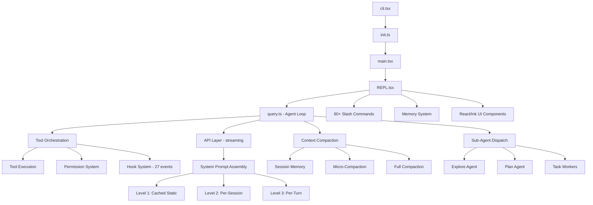

# Deep Dive Analysis Report — Claude Code CLI Source

> Target: `C:\Users\alfio\Downloads\aaa\src` (~1902 TypeScript/TSX files)
> Date: 2026-04-04
> Purpose: Reference for replicating functionality in claude-code-gui

---

## Executive Summary

Claude Code is a ~1900-file TypeScript CLI built on a custom Ink fork (terminal React renderer). Its architecture centers on an async generator agent loop (`query.ts`) that streams API responses, dispatches tools in parallel batches, and manages context compaction across 5 strategies. The system prompt is assembled from ~110 modular strings split by a cache boundary marker for cost optimization. The codebase uses dead-code elimination, lazy loading, feature gates, and dual state architecture (global singleton + React store).

## Project at a Glance

Claude Code is an AI coding assistant that runs in the terminal. It accepts natural language instructions, reasons about code, and uses tools (file read/write, bash, search, web access) to complete software engineering tasks. Sessions are interactive REPL loops where the model alternates between text responses and tool calls until the task is done. The CLI supports sub-agents (Plan, Explore, Task workers), custom agents, MCP servers, hooks, slash commands, memory, and remote sessions via WebSocket/SSE bridge.

For our GUI (claude-code-gui), we use the Agent SDK which wraps this entire system. We interface with `query()` via the SDK, not directly with the CLI internals.

---

## Architecture Overview

## Technology Decisions

| Decision | Choice | Why |
|----------|--------|-----|
| Runtime | Bun (with Node fallback) | Fast startup, native string width, Bun.wrapAnsi |
| UI framework | Custom Ink fork (terminal React) | React component model for terminal UI |
| API layer | Streaming with SSE | Real-time token output |
| Tool execution | Parallel batches (max 10) | Throughput — start tools while API still streaming |
| Prompt caching | SYSTEM_PROMPT_DYNAMIC_BOUNDARY | Cost optimization — static prefix cached globally |
| State | Dual: global singleton + React external store | Bootstrap state (costs, session) vs UI state (messages, tools) |
| Diff rendering | Native Rust/NAPI module | Performance for large diffs |
| String width | 3-tier (ASCII > Unicode > Intl.Segmenter) | Correct handling of CJK, emoji, combining marks |

---

## Key Systems Analysis

### 1. System Prompt Assembly

**Entry**: `getSystemPrompt()` at `constants/prompts.ts:444`

Returns `string[]` where each element becomes an API system prompt block. The boundary marker `SYSTEM_PROMPT_DYNAMIC_BOUNDARY` splits the prompt into:

- **Above boundary** (globally cached): identity, safety, tool guidance, style rules
- **Below boundary** (per-session): CLAUDE.md, git status, MCP servers, memory, language

Sections use two registration functions:
- `systemPromptSection()` — memoized, computed once per session
- `DANGEROUS_uncachedSystemPromptSection()` — recomputed every turn, breaks cache

**Full details**: `targeted-prompts.md`

### 2. Agent Loop

**Entry**: `query.ts` queryLoop (lines 241-1729)

A `while(true)` async generator that:
1. Manages context (snip/microcompact/autocompact)
2. Calls API with streaming
3. Collects `tool_use` blocks
4. Executes tools (parallel batches, max 10)
5. Appends results
6. Continues if tools were called, terminates on text-only response

**7 recovery paths**: max-output-tokens retry, reactive compact, context collapse, model fallback, rate limit backoff, API error retry, abort signal handling.

**Tool dispatch pipeline**: input validation → PreToolUse hooks → permission check (rules + mode + classifier) → `tool.call()` → PostToolUse hooks.

`StreamingToolExecutor` starts tool execution while the API response is still streaming.

**Full details**: `targeted-coordinator.md`

### 3. Context Compaction

**5 strategies in priority order**:

1. **Session Memory Compaction** — uses pre-built memory file from background agent, no API call, keeps 10K-40K tokens recent
2. **Reactive Compact** — groups by API round, summarizes in chunks (experimental)
3. **Traditional Full** — forks summarizer agent with 9-section template, restores top-5 files + skills
4. **Cached Microcompact** — server-side cache editing, deletes old tool results without breaking prefix cache
5. **Time-based Microcompact** — clears old results when server cache is cold

Auto-compact triggers at configurable token thresholds. Both `getUserContext()` and `getSystemContext()` caches are cleared on compaction.

**Full details**: `targeted-context-commands.md`

### 4. Terminal Rendering

**Markdown**: 3 entry points:
- `applyMarkdown()` — pure ANSI string output
- `<Markdown>` — hybrid React+ANSI (tables as React components, rest as ANSI)
- `<StreamingMarkdown>` — splits at last block boundary, only re-parses the growing tail

LRU token cache (500 entries). Fast-path regex skips lexer for plain text.

**Table 3-step column width algorithm**:
1. Measure min width (longest word) and ideal width (full content) per column
2. Compute available space minus border overhead and safety margin
3. Distribute: ideal if fits → proportional if overflow → hard word-break if min doesn't fit

Falls back to vertical key-value format when any row exceeds 4 lines.

**Full ANSI parser stack**: tokenizer (streaming state machine), semantic parser, SGR (colon-separated subparams), CSI/DEC/OSC generators.

**String width**: ASCII fast path → Unicode `eastAsianWidth()` → full grapheme segmentation via `Intl.Segmenter`.

**Full details**: `targeted-rendering.md`

### 5. Command System

**3 command types**: `local` (TypeScript function), `local-jsx` (React component), `prompt` (injected into conversation).

60+ built-in commands + dynamic loading from `.claude/skills/`, plugins, workflows, MCP. Commands are lazy-loaded, feature-gated, and auth-gated.

### 6. Memory System

4 types: `user`, `feedback`, `project`, `reference`. File-based storage at `~/.claude/projects/<slug>/memory/`. MEMORY.md serves as 200-line index. Relevant memories selected at query time by Sonnet side-query (up to 5). Freshness warnings for memories older than 1 day.

### 7. Sub-Agent System

Agents are recursive `query()` calls with filtered tools:
- **Explore** — read-only search, haiku model, no CLAUDE.md
- **Plan** — read-only architecture, inherits model, no CLAUDE.md
- **Verification** — adversarial testing, background, verdict format
- **Custom** — loaded from `.claude/agents/*.md` with YAML frontmatter

Async agents get isolated AbortControllers, restricted tool sets, auto-denied permissions. Results flow back as `<task-notification>` XML.

**Coordinator Mode** transforms Claude into orchestrator with only Agent/SendMessage/TaskStop tools.

### 8. Permission System

5 external modes + auto. Permission check flow:
1. Static rule match (always allow read-only tools)
2. Mode-based decision (bypassPermissions, plan, etc.)
3. Classifier-based analysis for ambiguous cases
4. User prompt for approval

27 hook events with sync/async response schemas.

### 9. Settings

5-source priority chain: user < project < local < flag < policy. Schema defines: model, permissions, hooks, output styles, language, effort level, agent selection.

---

## What claude-code-gui Should Replicate vs Ignore

### Replicate (via SDK or in GUI)

| Feature | How |
|---------|-----|
| Agent loop | SDK handles via `query()` — we get events |
| Tool results display | Parse SDK events, render in xterm.js/chat |
| Permission prompts | SDK emits permission events, we show UI |
| Streaming text | SDK streams assistant text, we render |
| Sub-agents | SDK supports `agent` parameter |
| Memory | SDK uses memory system automatically |
| System prompt context | SDK injects CLAUDE.md, git status |
| Context compaction | SDK handles automatically |
| Session history | We can browse via SDK `listSessions()` |

### Ignore (handled by SDK internally)

| Feature | Why |
|---------|-----|
| Prompt assembly | SDK builds prompts internally |
| Tool dispatch | SDK executes tools internally |
| Permission rules/classifier | SDK handles permission logic |
| Hook system | SDK runs hooks internally |
| ANSI parser stack | We use xterm.js which has its own |
| Ink/React terminal renderer | We use xterm.js + React DOM |
| MCP server management | SDK manages MCP connections |
| Bridge/remote sessions | We don't do remote — local only |

### Partially Replicate (enhance beyond SDK)

| Feature | Our approach |
|---------|-------------|
| Markdown rendering | xterm.js ANSI formatting (our AnsiUtils + formatTable) |
| Table formatting | Our formatTable with box-drawing borders |
| Spinner/progress | Our InputManager spinner system |
| Slash commands | Our CommandMenu + sidecar passthrough |
| Theming | Our 30-theme system (more than CLI's 6) |
| Tab management | Not in CLI — our addition |
| Chat UI | Not in CLI — our addition |

---

## Risk Assessment

| Category | Notes |
|----------|-------|
| SDK dependency | We depend on Agent SDK for core loop — SDK API changes could break us |
| Streaming fidelity | Our xterm.js rendering must match SDK event shapes exactly |
| Permission UX | SDK permission events need responsive UI — race conditions possible |
| Context limits | SDK handles compaction, but we should display token usage |
| Sub-agent display | Agent teams events need proper UI (sidebar, status tracking) |

---

## Quick Reference: Which File to Consult

| Your Task | Start With | Also Check |
|-----------|-----------|------------|
| Understand overall architecture | `07-final-report.md` | `01-structure.md` |
| Understand prompt system | `targeted-prompts.md` | `02-interfaces.md` §1 |
| Understand agent loop | `targeted-coordinator.md` | `02-interfaces.md` §2-3 |
| Understand rendering | `targeted-rendering.md` | Compare with our `AnsiUtils.ts` |
| Understand commands/memory | `targeted-context-commands.md` | `02-interfaces.md` §5-6 |
| Add new feature to GUI | `02-interfaces.md` "What to replicate" | Relevant targeted file |
| Debug SDK integration | `targeted-coordinator.md` | `targeted-prompts.md` |

---

## Analysis Metadata

- **Target**: `C:\Users\alfio\Downloads\aaa\src`
- **Files analyzed**: ~1902 TypeScript/TSX
- **Agents used**: 5 parallel (Structure, Prompts, Coordinator, Rendering, Context/Commands)
- **Output files**: 7 (01-structure, 02-interfaces, 4 targeted analyses, this report)
- **Total tokens consumed**: ~626K across all agents
- **Date**: 2026-04-04
