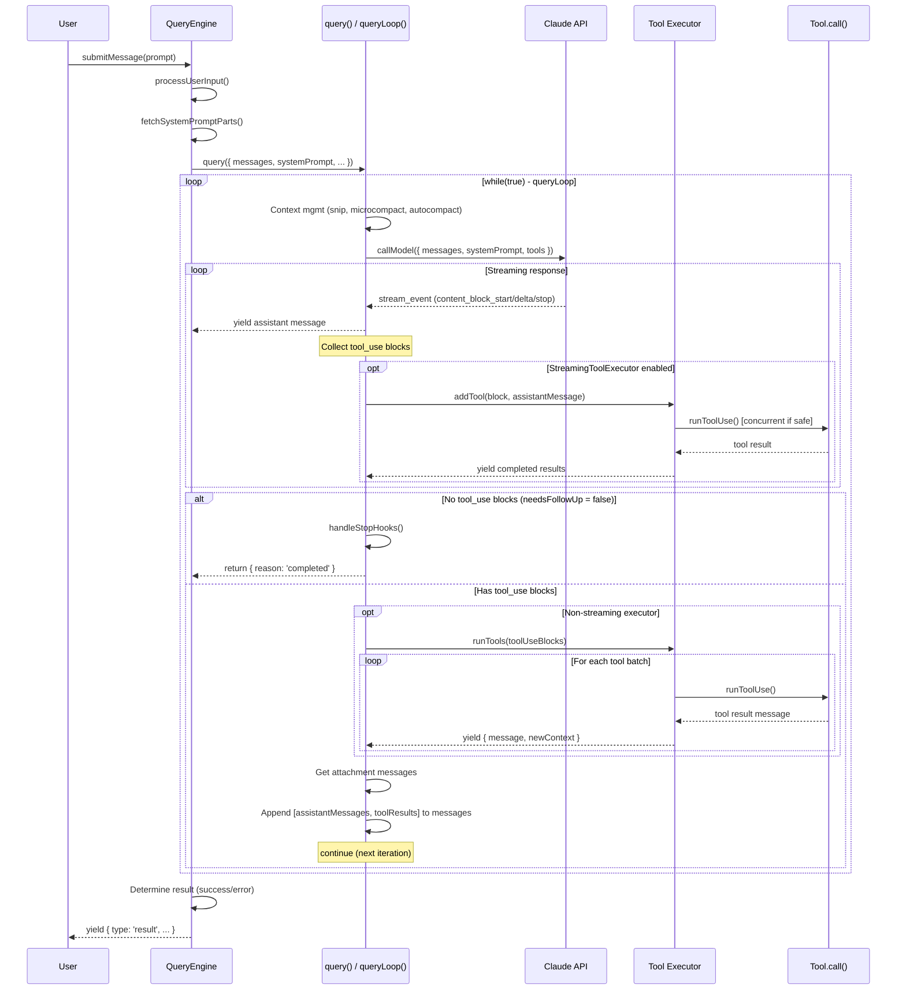

# Claude Code Agent Loop and Coordinator System - Deep Dive

Source: `C:\Users\alfio\Downloads\aaa\src\` (Claude Code CLI codebase)

---

## Agent Loop Flow

The agent loop is an async generator pipeline with three layers:

```
QueryEngine.submitMessage()  -->  query()  -->  queryLoop()  -->  API streaming + tool execution
```

### Step-by-step cycle

1. **User input arrives** at `QueryEngine.submitMessage()` (`QueryEngine.ts:209`)
2. **Input is processed** via `processUserInput()` -- handles slash commands, attachments, filters
3. **Messages are pushed** to `mutableMessages` and persisted to transcript
4. **System prompt is assembled** from: default prompt + custom prompt + append prompt + memory mechanics + CLAUDE.md (`QueryEngine.ts:321-325`)
5. **User context is built** from CLAUDE.md content, current date, and coordinator worker context (`QueryEngine.ts:302-308`)
6. **`query()` is called** as an async generator (`QueryEngine.ts:675`)
7. **Inside `queryLoop()`** (`query.ts:241`), a `while(true)` loop runs:
   - Context management (snip, microcompact, autocompact, context collapse)
   - API call via `deps.callModel()` with streaming (`query.ts:659-708`)
   - Streaming messages are yielded as they arrive
   - Tool use blocks are collected during streaming
   - Tools execute (streaming or post-streaming)
   - Results are appended to messages
   - Loop continues if `needsFollowUp` is true (tool calls present)
   - Loop terminates when no tool calls remain (pure text response)

### Mermaid Sequence Diagram



### Loop termination conditions (`query.ts`)

| Condition | Terminal Reason | Line |
|-----------|----------------|------|
| No tool_use blocks + stop hooks pass | `completed` | ~1357 |
| AbortController signal fired during streaming | `aborted_streaming` | ~1051 |
| AbortController signal fired during tools | `aborted_tools` | ~1515 |
| `maxTurns` exceeded | `max_turns` | ~1711 |
| Prompt too long (blocking limit) | `blocking_limit` | ~647 |
| Stop hook prevented continuation | `stop_hook_prevented` | ~1279 |
| Post-tool hook stopped | `hook_stopped` | ~1520 |
| API/model error | `model_error` | ~996 |
| Image error | `image_error` | ~978 |
| Prompt too long (unrecoverable) | `prompt_too_long` | ~1175 |

### Recovery loops within queryLoop

The loop has several "continue" paths that retry without returning to the user:

1. **max_output_tokens recovery** (`query.ts:1223-1252`): Injects "Output token limit hit. Resume directly..." up to 3 times
2. **max_output_tokens escalation** (`query.ts:1199-1221`): Retries with 64k output tokens
3. **Reactive compact retry** (`query.ts:1119-1166`): Compacts history after prompt-too-long
4. **Context collapse drain** (`query.ts:1090-1117`): Drains staged collapses before compact
5. **Stop hook blocking** (`query.ts:1282-1305`): Re-runs with stop-hook error messages
6. **Token budget continuation** (`query.ts:1308-1341`): Continues if within budget
7. **Model fallback** (`query.ts:894-953`): Switches to fallback model on FallbackTriggeredError

---

## Tool System

### Tool Registration

All tools are registered in `tools.ts:193` via `getAllBaseTools()`:

```typescript
export function getAllBaseTools(): Tools {
  return [
    AgentTool, TaskOutputTool, BashTool,
    GlobTool, GrepTool, // conditionally included
    FileReadTool, FileEditTool, FileWriteTool,
    WebFetchTool, WebSearchTool, NotebookEditTool,
    SkillTool, TodoWriteTool, ExitPlanModeV2Tool,
    GrepTool, BashTool, EnterPlanModeTool,
    AskUserQuestionTool, TaskStopTool, LSPTool,
    ListMcpResourcesTool, ReadMcpResourceTool,
    ToolSearchTool, EnterWorktreeTool, ExitWorktreeTool,
    ConfigTool, TaskCreateTool, TaskGetTool, TaskUpdateTool, TaskListTool,
    // Plus conditionally: TeamCreateTool, TeamDeleteTool, SendMessageTool,
    // SleepTool, MonitorTool, WorkflowTool, etc.
    // Plus MCP tools loaded dynamically
  ]
}
```

Tools are assembled per-context by `assembleToolPool()` (referenced in `AgentTool.tsx:16`) which applies filtering based on permission mode, coordinator mode, etc.

### Tool Interface (`Tool.ts:362-695`)

Every tool implements:

```typescript
type Tool = {
  name: string
  aliases?: string[]
  inputSchema: ZodType           // Zod schema for input validation
  outputSchema?: ZodType         // Optional output schema

  call(args, context, canUseTool, parentMessage, onProgress?): Promise<ToolResult>
  checkPermissions(input, context): Promise<PermissionResult>
  validateInput?(input, context): Promise<ValidationResult>

  isConcurrencySafe(input): boolean    // Can run in parallel?
  isReadOnly(input): boolean           // Pure read operation?
  isEnabled(): boolean                 // Available in current env?
  isDestructive?(input): boolean       // Irreversible operation?

  prompt(options): Promise<string>     // Tool description for Claude
  description(input, options): Promise<string>

  // UI rendering methods
  renderToolUseMessage(input, options): ReactNode
  renderToolResultMessage?(content, progress, options): ReactNode
  mapToolResultToToolResultBlockParam(content, toolUseID): ToolResultBlockParam

  maxResultSizeChars: number           // Disk persistence threshold
}
```

`buildTool()` (`Tool.ts:783`) provides defaults for common methods:
- `isEnabled` -> `true`
- `isConcurrencySafe` -> `false` (conservative)
- `isReadOnly` -> `false`
- `checkPermissions` -> `{ behavior: 'allow', updatedInput }`

### Tool Dispatch (`toolExecution.ts:337-490`)

`runToolUse()` is the central dispatcher:

1. **Find tool** by name in available tools, falling back to alias lookup (`toolExecution.ts:344-356`)
2. **Check abort** -- if aborted, return cancel message (`toolExecution.ts:415-453`)
3. **Check permissions and execute** via `streamedCheckPermissionsAndCallTool()` (`toolExecution.ts:455-466`)
4. **Error handling** -- catches exceptions, wraps in `<tool_use_error>` XML (`toolExecution.ts:469-489`)

### Permission Checking

The permission check flow (inside `streamedCheckPermissionsAndCallTool`, `toolExecution.ts:492`):

1. **Validate input** via `tool.validateInput()` -- schema check
2. **Run PreToolUse hooks** -- external hooks can allow/deny
3. **Check tool-specific permissions** via `tool.checkPermissions()`
4. **Check general permissions** via `canUseTool()` -- combines:
   - Always-allow rules (session, config, CLI args)
   - Always-deny rules
   - Permission mode (plan/acceptEdits/bypassPermissions/auto)
   - YOLO classifier for auto mode
5. **Permission prompt** (interactive) or auto-deny (non-interactive/background agents)
6. **Execute tool** via `tool.call()`
7. **Run PostToolUse hooks**

### Parallel Tool Execution (`toolOrchestration.ts`)

`runTools()` (`toolOrchestration.ts:19-82`) partitions tool calls into batches:

```typescript
function partitionToolCalls(toolUseMessages, toolUseContext): Batch[] {
  // Groups consecutive concurrency-safe tools together
  // Non-concurrency-safe tools get their own single-item batch
}
```

- **Concurrent batch**: All tools where `isConcurrencySafe(input) === true` run in parallel via `runToolsConcurrently()` using an `all()` helper with max concurrency of 10 (env: `CLAUDE_CODE_MAX_TOOL_USE_CONCURRENCY`)
- **Serial batch**: Non-safe tools run one at a time via `runToolsSerially()`
- Context modifiers from concurrent tools are queued and applied after the batch completes

### StreamingToolExecutor (`StreamingToolExecutor.ts`)

When the `streamingToolExecution` gate is enabled, tools start executing while the API response is still streaming:

```typescript
class StreamingToolExecutor {
  addTool(block, assistantMessage)    // Called as tool_use blocks arrive
  getCompletedResults()               // Polls for finished tools (during streaming)
  getRemainingResults()               // Drains all remaining (after streaming ends)
}
```

Concurrency control: concurrent-safe tools can overlap; exclusive tools must wait. Results are buffered and emitted in order received.

### Tool Result Formatting

Tool results are formatted as `UserMessage` with `tool_result` content blocks:

```typescript
// Success (from tool.mapToolResultToToolResultBlockParam)
{
  type: 'tool_result',
  tool_use_id: toolUse.id,
  content: '...'   // Tool-specific content
}

// Error
{
  type: 'tool_result',
  tool_use_id: toolUse.id,
  content: '<tool_use_error>Error: ...</tool_use_error>',
  is_error: true
}

// Rejected by user
{
  type: 'tool_result',
  tool_use_id: toolUse.id,
  content: 'The user denied this operation.',
  is_error: true
}
```

Large results (exceeding `tool.maxResultSizeChars`) are persisted to disk and replaced with a preview + file path.

---

## Sub-Agent System

### Agent Types

Built-in agents from `builtInAgents.ts:22-72`:

| Agent | Type | Mode | Purpose |
|-------|------|------|---------|
| `GENERAL_PURPOSE_AGENT` | `worker` | Default | General tasks |
| `EXPLORE_AGENT` | `Explore` | Read-only | Codebase exploration |
| `PLAN_AGENT` | `Plan` | Read-only | Planning and analysis |
| `VERIFICATION_AGENT` | `verification` | Default | Testing/verification |
| `STATUSLINE_SETUP_AGENT` | - | - | Terminal statusline setup |
| `CLAUDE_CODE_GUIDE_AGENT` | - | - | Help with Claude Code |

In coordinator mode, a `worker` agent type is used with its own system prompt (`coordinatorMode.ts:116-369`).

Custom agents are loaded from `.claude/agents/*.md` files.

### Agent Spawning (`AgentTool.tsx:239-300+` and `runAgent.ts:248-329`)

The `AgentTool.call()` method handles dispatch:

1. **Resolve agent definition** from `subagent_type` parameter against available definitions
2. **Check permissions** (deny rules, MCP requirements)
3. **Branch by spawn type**:
   - **Teammate spawn** (team_name + name): `spawnTeammate()` -- tmux/in-process
   - **Remote spawn** (isolation: "remote"): `teleportToRemote()`
   - **Background/async spawn** (run_in_background=true or coordinator mode): Registers async agent, runs via `runAsyncAgentLifecycle()`
   - **Synchronous spawn** (default): Runs inline via `runAgent()` generator

### `runAgent()` Implementation (`runAgent.ts:248-329+`)

```typescript
async function* runAgent({
  agentDefinition, promptMessages, toolUseContext, canUseTool,
  isAsync, querySource, model, maxTurns, availableTools, ...
}): AsyncGenerator<Message, void> {
```

Key setup:
1. **Create agentId** (`runAgent.ts:347`)
2. **Resolve model** via `getAgentModel()` -- agent frontmatter > caller override > parent model
3. **Initialize MCP servers** specific to the agent definition (`runAgent.ts:95-217`)
4. **Build context**: user context (optionally stripped of CLAUDE.md for Explore/Plan), system context (optionally stripped of gitStatus)
5. **Resolve tools** via `resolveAgentTools()` -- filters based on agent definition's tool allowlist/denylist + async restrictions
6. **Build system prompt** for the agent (`runAgent.ts:508-518`)
7. **Create abort controller** -- async agents get independent controller; sync agents share parent's
8. **Execute hooks** -- `SubagentStart` hooks for additional context
9. **Register frontmatter hooks** from agent definition
10. **Call `query()`** with agent-specific parameters and yield all messages

### Agent Tool Isolation (`constants/tools.ts`)

```typescript
// Tools ALWAYS blocked for agents
ALL_AGENT_DISALLOWED_TOOLS = {
  TaskOutputTool, ExitPlanModeTool, EnterPlanModeTool,
  AgentTool (unless ant user), AskUserQuestionTool, TaskStopTool
}

// Tools allowed for ASYNC agents (restrictive allowlist)
ASYNC_AGENT_ALLOWED_TOOLS = {
  FileRead, WebSearch, TodoWrite, Grep, WebFetch, Glob,
  Bash/PowerShell, FileEdit, FileWrite, NotebookEdit,
  Skill, SyntheticOutput, ToolSearch, EnterWorktree, ExitWorktree
}

// Additional tools for in-process teammates
IN_PROCESS_TEAMMATE_ALLOWED_TOOLS = {
  TaskCreate, TaskGet, TaskList, TaskUpdate, SendMessage, Cron tools
}
```

Tool filtering logic in `agentToolUtils.ts:70-100`:
- MCP tools (`mcp__*`) are always allowed for all agents
- `ExitPlanMode` is allowed when agent is in plan mode
- Async agents are restricted to `ASYNC_AGENT_ALLOWED_TOOLS`
- Custom (non-builtin) agents additionally blocked from `CUSTOM_AGENT_DISALLOWED_TOOLS`

### Agent Permission Modes (`runAgent.ts:415-498`)

Each agent can override the parent's permission mode:
- Agent definition can specify `permissionMode` (e.g., "plan" for read-only agents)
- Parent modes `bypassPermissions`, `acceptEdits`, and `auto` always take precedence
- Async agents that can't show UI get `shouldAvoidPermissionPrompts: true` -- permissions auto-deny
- Async agents with UI (bubble mode) get `awaitAutomatedChecksBeforeDialog: true`

### Agent Context Sharing

Agent context is managed via `createSubagentContext()` (referenced in `runAgent.ts`):
- **Fork context**: Parent messages can be passed to agent as initial context (`forkContextMessages`)
- **File state cache**: Cloned from parent (fork) or fresh (independent agent)
- **Scratchpad**: Shared directory for cross-worker knowledge (coordinator mode, `coordinatorMode.ts:104-106`)
- **setAppState**: No-op for async agents (isolated); real for sync agents (shared)
- **setAppStateForTasks**: Always reaches root store for session-scoped infrastructure

### Agent Result Flow

For **synchronous agents**, results flow back through the `runAgent()` generator -- every message from `query()` is yielded to the parent's tool execution context.

For **async agents** (background, coordinator workers):
1. Agent runs independently via `runAsyncAgentLifecycle()`
2. Progress updates emit via the task system (`LocalAgentTask`)
3. Completion/failure enqueues a notification (`enqueueAgentNotification()`)
4. Notification arrives as a `<task-notification>` XML in the parent's message queue
5. Parent sees it as a user-role message in the next query iteration (`query.ts:1570-1578`)

---

## Coordinator Mode

### Overview (`coordinatorMode.ts`)

Coordinator mode (`CLAUDE_CODE_COORDINATOR_MODE=1`) transforms Claude Code into an orchestrator:

- **Coordinator** has only: `Agent`, `SendMessage`, `TaskStop` (plus subscribe_pr_activity)
- **Workers** have: standard tools (Bash, Read, Edit, Glob, Grep, etc.) + MCP + Skills
- Coordinator cannot use tools directly -- it must delegate to workers
- Worker results arrive as `<task-notification>` XML in user-role messages

### System Prompt (`coordinatorMode.ts:111-369`)

The coordinator system prompt defines:
1. **Role**: Orchestrate tasks, direct workers, synthesize results
2. **Tools**: Agent (spawn), SendMessage (continue), TaskStop (kill)
3. **Task workflow**: Research (parallel) -> Synthesis (coordinator) -> Implementation -> Verification
4. **Worker prompt guidelines**: Self-contained, file paths, line numbers, no lazy delegation

### Worker Context (`coordinatorMode.ts:80-109`)

```typescript
function getCoordinatorUserContext(mcpClients, scratchpadDir?) {
  // Lists worker tools for the coordinator's awareness
  // Includes MCP server names
  // Includes scratchpad directory path
}
```

---

## Message Types and Conversation Management

### Core Message Types

Messages flow through the system as a discriminated union. Key types (defined in `types/message.ts` and used throughout):

| Type | Role | Purpose |
|------|------|---------|
| `UserMessage` | user | User input, tool results, interruptions |
| `AssistantMessage` | assistant | Model responses with content blocks |
| `SystemMessage` | system | Compact boundaries, API errors, warnings |
| `AttachmentMessage` | attachment | File changes, skill discovery, hook context, queued commands |
| `ProgressMessage` | progress | Tool execution progress updates |
| `StreamEvent` | stream_event | Raw SSE events from API |
| `TombstoneMessage` | tombstone | Signal to remove orphaned messages |
| `ToolUseSummaryMessage` | tool_use_summary | Haiku-generated tool use summaries |

### Message Content Blocks (Anthropic API)

AssistantMessage contains `message.content` blocks:
- `text` -- Claude's text response
- `tool_use` -- Tool invocation with `{ id, name, input }`
- `thinking` / `redacted_thinking` -- Extended thinking blocks

UserMessage content can be:
- Plain text string
- Array of `ContentBlockParam`:
  - `tool_result` -- Response to a tool_use
  - `text` -- Additional context
  - `image` -- Pasted images

### Conversation History Management

**Storage**: Messages are persisted to transcript files via `recordTranscript()` (`QueryEngine.ts:451`).

**Context window management** (all in `query.ts` queryLoop):

1. **Snip compact** (`query.ts:401-410`): Feature-gated truncation of old messages, freeing tokens
2. **Microcompact** (`query.ts:414-419`): Lightweight compression of tool results
3. **Context collapse** (`query.ts:440-447`): Progressive folding of old context
4. **Autocompact** (`query.ts:454-467`): Full conversation summarization when token count is high
5. **Reactive compact** (`query.ts:1119-1166`): Emergency compaction on prompt-too-long errors
6. **Tool result budget** (`query.ts:379-394`): Per-message cap on aggregate tool result size

**Message normalization**: `normalizeMessagesForAPI()` strips UI-only messages before sending to the API.

### QueryEngine State

```typescript
class QueryEngine {
  private mutableMessages: Message[]        // Full conversation history
  private abortController: AbortController  // Cancellation signal
  private permissionDenials: SDKPermissionDenial[]  // Tracked for SDK reporting
  private totalUsage: NonNullableUsage      // Accumulated API usage
  private readFileState: FileStateCache     // LRU cache of read files
  private discoveredSkillNames: Set<string> // Turn-scoped skill tracking
}
```

---

## Streaming and Response Handling

### API Call and Streaming (`query.ts:659-863`)

The streaming loop iterates over `deps.callModel()`:

```typescript
for await (const message of deps.callModel({ messages, systemPrompt, ... })) {
  // 1. Handle streaming fallback (model switch mid-stream)
  // 2. Backfill tool_use inputs for SDK observers
  // 3. Withhold recoverable errors (prompt-too-long, max-output-tokens)
  // 4. Yield non-withheld messages
  // 5. Collect tool_use blocks into toolUseBlocks[]
  // 6. Feed streaming tool executor
  // 7. Yield completed streaming tool results
}
```

### Message Withholding

Certain error messages are withheld during streaming to enable recovery:

- **Prompt too long** (`isPromptTooLongMessage`): Withheld for collapse drain / reactive compact
- **Max output tokens** (`isWithheldMaxOutputTokens`): Withheld for escalation / recovery loop
- **Media size errors** (`isWithheldMediaSizeError`): Withheld for reactive compact strip-retry

Withheld messages are either:
- Consumed by recovery (never yielded)
- Surfaced if recovery fails

### SDK Event Pipeline (`QueryEngine.ts:757-969`)

QueryEngine's `submitMessage()` transforms raw query events into SDK messages:

```
query() yields -> switch(message.type):
  assistant  -> push to mutableMessages, yield normalized
  user       -> push to mutableMessages, yield normalized
  progress   -> push to mutableMessages, record transcript
  stream_event -> accumulate usage, optionally yield if includePartialMessages
  attachment -> push to mutableMessages, handle structured_output / max_turns
  system     -> handle compact_boundary (splice old messages), api_retry
  tombstone  -> skip (control signal)
  tool_use_summary -> yield to SDK
```

### Usage Tracking

```typescript
// Per-message: updated on message_start and message_delta stream events
currentMessageUsage = updateUsage(currentMessageUsage, event.usage)

// Per-turn: accumulated on message_stop
this.totalUsage = accumulateUsage(this.totalUsage, currentMessageUsage)
```

---

## Error Handling and Recovery

### API Error Recovery (`query.ts:893-997`)

1. **FallbackTriggeredError**: Switch to `fallbackModel`, clear state, retry
2. **ImageSizeError / ImageResizeError**: Yield error message, return `image_error`
3. **General throws**: Yield missing tool_result blocks for orphaned tool_use, surface error

### Tool Execution Error Handling (`toolExecution.ts:469-489`)

```typescript
try {
  yield* streamedCheckPermissionsAndCallTool(...)
} catch (error) {
  yield {
    message: createUserMessage({
      content: [{
        type: 'tool_result',
        content: `<tool_use_error>Error calling tool: ${errorMessage}</tool_use_error>`,
        is_error: true,
        tool_use_id: toolUse.id,
      }]
    })
  }
}
```

The model sees the error as a tool result and can adjust its approach.

### Streaming Fallback (`query.ts:709-741`)

When a streaming fallback occurs mid-response:
1. Yield tombstones for orphaned assistant messages
2. Clear all state (assistantMessages, toolResults, toolUseBlocks)
3. Discard StreamingToolExecutor (create fresh one)
4. Retry loop continues with fallback model

### Abort Handling

- **During streaming** (`query.ts:1015-1051`): Drain StreamingToolExecutor remaining results, yield interruption message
- **During tool execution** (`query.ts:1484-1516`): Yield interruption message
- **Submit-interrupts** (reason === 'interrupt'): Skip interruption message (queued user message provides context)

### Budget Enforcement (`QueryEngine.ts:971-1002`)

After each yielded message, QueryEngine checks `maxBudgetUsd`:
```typescript
if (maxBudgetUsd !== undefined && getTotalCost() >= maxBudgetUsd) {
  yield { type: 'result', subtype: 'error_max_budget_usd', ... }
  return
}
```

---

## Key Interfaces and Types

### QueryEngineConfig (`QueryEngine.ts:130-173`)

```typescript
type QueryEngineConfig = {
  cwd: string
  tools: Tools
  commands: Command[]
  mcpClients: MCPServerConnection[]
  agents: AgentDefinition[]
  canUseTool: CanUseToolFn
  getAppState: () => AppState
  setAppState: (f: (prev: AppState) => AppState) => void
  initialMessages?: Message[]
  readFileCache: FileStateCache
  customSystemPrompt?: string
  appendSystemPrompt?: string
  userSpecifiedModel?: string
  fallbackModel?: string
  thinkingConfig?: ThinkingConfig
  maxTurns?: number
  maxBudgetUsd?: number
  taskBudget?: { total: number }
  jsonSchema?: Record<string, unknown>  // Structured output
  verbose?: boolean
  replayUserMessages?: boolean
  handleElicitation?: ToolUseContext['handleElicitation']
  includePartialMessages?: boolean
  setSDKStatus?: (status: SDKStatus) => void
  abortController?: AbortController
  orphanedPermission?: OrphanedPermission
  snipReplay?: (msg, store) => { messages; executed } | undefined
}
```

### ToolUseContext (`Tool.ts:158-300`)

The "god object" threaded through all tool calls:

```typescript
type ToolUseContext = {
  options: {
    commands: Command[]
    tools: Tools
    mainLoopModel: string
    thinkingConfig: ThinkingConfig
    mcpClients: MCPServerConnection[]
    agentDefinitions: AgentDefinitionsResult
    maxBudgetUsd?: number
    customSystemPrompt?: string
    appendSystemPrompt?: string
    refreshTools?: () => Tools
  }
  abortController: AbortController
  readFileState: FileStateCache
  getAppState(): AppState
  setAppState(f: (prev: AppState) => AppState): void
  setAppStateForTasks?: (f: (prev: AppState) => AppState): void
  messages: Message[]
  agentId?: AgentId
  agentType?: string
  setInProgressToolUseIDs: (f) => void
  setResponseLength: (f) => void
  updateFileHistoryState: (updater) => void
  updateAttributionState: (updater) => void
  queryTracking?: QueryChainTracking
  contentReplacementState?: ContentReplacementState
  // ...many more optional fields for specific features
}
```

### TaskState (`Task.ts`)

```typescript
type TaskType = 'local_bash' | 'local_agent' | 'remote_agent' |
                'in_process_teammate' | 'local_workflow' | 'monitor_mcp' | 'dream'

type TaskStatus = 'pending' | 'running' | 'completed' | 'failed' | 'killed'

type TaskStateBase = {
  id: string
  type: TaskType
  status: TaskStatus
  description: string
  toolUseId?: string
  startTime: number
  endTime?: number
  outputFile: string
  outputOffset: number
  notified: boolean
}
```

### ToolResult (`Tool.ts:321-336`)

```typescript
type ToolResult<T> = {
  data: T                    // Tool-specific output
  newMessages?: Message[]    // Side-effect messages to inject
  contextModifier?: (context: ToolUseContext) => ToolUseContext
  mcpMeta?: {               // MCP protocol metadata
    _meta?: Record<string, unknown>
    structuredContent?: Record<string, unknown>
  }
}
```

### QueryParams (`query.ts:181-199`)

```typescript
type QueryParams = {
  messages: Message[]
  systemPrompt: SystemPrompt
  userContext: { [k: string]: string }
  systemContext: { [k: string]: string }
  canUseTool: CanUseToolFn
  toolUseContext: ToolUseContext
  fallbackModel?: string
  querySource: QuerySource
  maxOutputTokensOverride?: number
  maxTurns?: number
  skipCacheWrite?: boolean
  taskBudget?: { total: number }
}
```

### Terminal / Continue (query loop transitions)

```typescript
type Terminal = { reason: string; error?: Error; turnCount?: number }

type Continue =
  | { reason: 'next_turn' }
  | { reason: 'max_output_tokens_recovery'; attempt: number }
  | { reason: 'max_output_tokens_escalate' }
  | { reason: 'reactive_compact_retry' }
  | { reason: 'collapse_drain_retry'; committed: number }
  | { reason: 'stop_hook_blocking' }
  | { reason: 'token_budget_continuation' }
```

---

## Summary of Architecture for GUI Replication

The core loop pattern for replicating in a GUI app:

1. **Build system prompt** + user context + system context
2. **Call API** with messages, system prompt, tools (streaming)
3. **Collect streaming response** -- yield assistant text to UI as it arrives
4. **Detect tool_use blocks** in the response
5. **Execute tools** (respecting concurrency: read-only in parallel, writes serial)
6. **Check permissions** before each tool execution
7. **Format tool results** as tool_result blocks
8. **Append** [assistant messages, tool results] to conversation history
9. **Loop back to step 2** if tools were called
10. **Stop** when no tool calls remain (or maxTurns/budget/abort)

Key design decisions:
- Async generator pattern enables streaming + backpressure
- Tool results are user-role messages (Anthropic API requirement)
- Sub-agents are just recursive query() calls with filtered tools and isolated context
- Context management (compaction) runs at the start of each loop iteration
- Errors from tools are fed back as tool_result errors -- the model self-corrects
