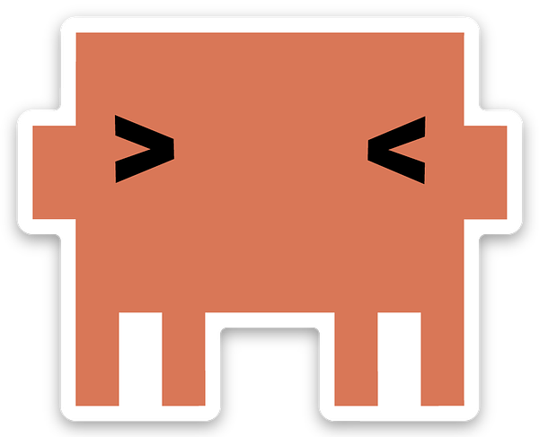

<p align="center">
  
</p>

<h1 align="center">Figtree</h1>

<p align="center">
  <strong>A native Windows app for managing Claude Code sessions in a tabbed interface.</strong><br>
  <sub>Pick a project. Pick a model. Hit Enter. Code.</sub>
</p>

<p align="center">
  <a href="https://github.com/acaprino/figtree/stargazers"></a>
  
  
  
  
</p>

<!-- TODO: Add hero screenshot here once captured
<p align="center">
  
</p>
-->

---

## Why Figtree?

I run a lot of Claude Code sessions across different projects. Terminal windows pile up, I lose track of which session is where, and when I close them I lose everything.

Figtree fixes that. It wraps the Claude Code Agent SDK in a native desktop app with tabs, so you can run multiple agents side by side, switch between projects instantly, and pick up right where you left off tomorrow.

- **No more juggling terminals** &mdash; all your sessions live in tabs, with output indicators so you know which ones need attention
- **No more `cd`-ing around** &mdash; your project directories are scanned automatically, type to filter, Enter to launch
- **No more lost context** &mdash; sessions persist across restarts, resume or fork any past session
- **No mouse required** &mdash; every action has a keyboard shortcut

---

## Features

### Multi-Tab Sessions

Run multiple concurrent AI coding sessions side by side. Tabs light up when agents produce new output. Exit codes display when sessions complete. Custom window chrome &mdash; no standard title bar.

<!-- TODO: screenshot -->

### Project Discovery

Figtree scans your project directories automatically. You see every project at a glance &mdash; which branch it's on, whether it has uncommitted changes, whether it has a `CLAUDE.md`. Add labels, sort by name or usage, type to filter. Create new projects or quick-launch any directory with F10.

<!-- TODO: screenshot -->

### Dual View

Switch between a **rich chat view** with markdown rendering, syntax highlighting, collapsible tool cards, and interactive permission prompts &mdash; or a **compact terminal view** for fast scanning. Switch without losing your session.

<!-- TODO: screenshot -->

### Session Persistence

Close Figtree, reopen it tomorrow. Your tabs and sessions are exactly where you left them. Resume or fork past sessions from the session panel (Ctrl+Shift+S). Browse all history in the session browser (Ctrl+Shift+H). Dead sessions are cleaned up automatically &mdash; no orphaned processes.

### Keyboard-First

Every feature is reachable without a mouse. Model, effort, permission mode &mdash; all switchable with a single keystroke.

| Action | Key |
|--------|-----|
| New tab | `Ctrl+T` |
| Close tab | `Ctrl+F4` |
| Launch project | `Enter` |
| Filter projects | Just type |
| Cycle model | `F4` |
| Cycle permission mode | `Tab` |
| Settings | `Ctrl+,` |

<details>
<summary>All keyboard shortcuts</summary>

#### Navigation
| Key | Action |
|-----|--------|
| `Ctrl+T` | New tab |
| `Ctrl+F4` | Close tab |
| `Ctrl+Tab` | Next tab |
| `Ctrl+Shift+Tab` | Previous tab |
| `Ctrl+1-9` | Switch to tab by number |
| `F1` | Toggle keyboard shortcuts |
| `F12` | Toggle About page |
| `Ctrl+U` | Toggle Usage page |
| `Ctrl+Shift+P` | Toggle System Prompts |
| `Ctrl+Shift+H` | Toggle Sessions browser |
| `Ctrl+Shift+S` | Toggle Session panel |

#### Settings (New Tab Page)
| Key | Action |
|-----|--------|
| `Tab` | Cycle permission mode |
| `F2` | Cycle effort level |
| `F3` | Cycle sort order |
| `F4` | Cycle model |

#### Actions
| Key | Action |
|-----|--------|
| `F5` | Create new project |
| `F6` | Open project in Explorer |
| `F8` | Label selected project |
| `F10` | Quick launch (any directory) |
| `Ctrl+,` | Open settings |
| `Enter` | Launch selected project |

#### Agent Tab
| Key | Action |
|-----|--------|
| `Ctrl+C` | Copy selection or interrupt agent |
| `Ctrl+V` | Paste (text or image) |

</details>

### 14+ Themes

Dark, light, and retro variants. Switchable via Ctrl+, settings. Themes apply to everything &mdash; window chrome, tabs, project list, chat, and terminal.

<details>
<summary>Included themes</summary>

Cyberpunk 2077, DaisyUI Retro, Dracula, Gandalf, Kanagawa, Light Arctic, Light Paper, Light Sakura, Light Solarized, Lofi, Matrix, Nord, Synthwave, Tokyo Night

Custom themes can be added by placing a JSON file in `data/themes/`.

</details>

### Agent Features

- Slash commands (`/`) and @agent mentions with autocomplete
- File attachments and image paste (Ctrl+V)
- Subagent task tracking with progress notifications
- Interrupt running agents (Ctrl+C)
- Live model and permission mode switching mid-session
- System prompts with YAML frontmatter

---

## Models & Permissions

| Model | ID | Context |
|-------|-----|---------|
| Sonnet | `claude-sonnet-4-6` | Standard |
| Opus | `claude-opus-4-6` | Standard |
| Haiku | `claude-haiku-4-5` | Standard |
| Sonnet 1M | `claude-sonnet-4-6[1m]` | Extended |
| Opus 1M | `claude-opus-4-6[1m]` | Extended |

| Permission Mode | Description |
|-----------------|-------------|
| Plan | Agent can only read and analyze |
| Accept edits | Auto-accepts file edits, prompts for other tools |
| Skip all | Bypasses all permission prompts |

---

## Getting Started

### Prerequisites

- **Windows 11** (or Windows 10 with WebView2)
- **Rust** toolchain ([rustup](https://rustup.rs/))
- **Node.js** 18+ and npm
- **Claude Code** (`npm i -g @anthropic-ai/claude-code`)

### Build & Run

```bash
git clone https://github.com/acaprino/figtree.git
cd figtree/app

npm install

# Development (hot-reload)
cargo tauri dev

# Production build
cargo tauri build
```

Release builds use LTO, single codegen unit, `opt-level = 3`, and symbol stripping for minimal binary size.

---

## Configuration

| Setting | Default | Description |
|---------|---------|-------------|
| Model | Sonnet | Claude model variant |
| Effort | High | Reasoning effort level |
| Permission mode | Plan | Tool permission behavior |
| Sort | Alpha | Project sort order |
| Theme | Dracula | UI theme |
| Font | Cascadia Code, 14px | Terminal font |
| View style | Chat | Chat or terminal view |
| Project dirs | `D:\Projects` | Directories to scan |

---

## Tech Stack

Built with **Tauri 2** (Rust backend) + **React 19** (TypeScript frontend) + a **Node.js sidecar** running the Claude Agent SDK. Communication flows as JSON-lines over stdin/stdout, with Win32 Job Objects ensuring clean process cleanup even on crashes.

<details>
<summary>Architecture diagram</summary>

```
+---------------------------------------------+
|  Frontend                                   |
|  React 19 . TypeScript 5.7 . Vite 6        |
|  react-markdown . @tanstack/react-virtual   |
+---------------------------------------------+
|  IPC Layer                                  |
|  Tauri 2 Commands . Tauri Channels          |
+---------------------------------------------+
|  Backend                                    |
|  Rust 2021 . Tokio . Win32 APIs             |
|  Sidecar Management . JSON-lines Bridge     |
|  Project Scanner . Settings Persistence     |
+---------------------------------------------+
|  Sidecar                                    |
|  Node.js . @anthropic-ai/claude-agent-sdk   |
+---------------------------------------------+
```

For detailed architecture, module reference, and IPC protocol, see [`docs/TECHNICAL.md`](docs/TECHNICAL.md).

</details>

---

## Contributing

Contributions welcome. [Open an issue](https://github.com/acaprino/figtree/issues) first to discuss what you'd like to change.

---

## License

[MIT](LICENSE)

---

<p align="center">
  <sub>Windows native. Keyboard-first. Built with Tauri 2, React 19, and Rust.</sub><br>
  <sub>Figtree &mdash; where ideas take root.</sub>
</p>
