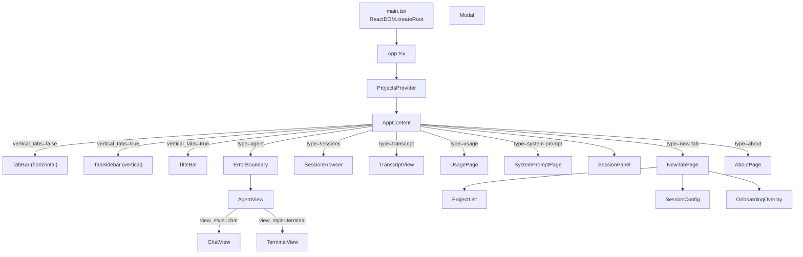

# Figtree -- Technical Documentation

**Version:** 1.0.0
**Platform:** Windows only
**Last verified:** 2026-03-20

---

## Table of Contents

1. [Project Overview](#1-project-overview)
2. [Getting Started](#2-getting-started)
3. [Architecture Overview](#3-architecture-overview)
4. [Rust Backend](#4-rust-backend)
5. [Node.js Sidecar](#5-nodejs-sidecar)
6. [React Frontend](#6-react-frontend)
7. [IPC Protocol](#7-ipc-protocol)
8. [Keyboard Shortcuts](#8-keyboard-shortcuts)
9. [Configuration](#9-configuration)
10. [Architecture Notes](#10-architecture-notes)
11. [Development Guide](#11-development-guide)

---

## 1. Project Overview

Figtree is a Windows-only Tauri 2 desktop application for selecting and launching Claude Code Agent SDK sessions in a tabbed interface. Users select a project from a scanned directory list, choose a model and settings, then launch an interactive agent session rendered in a React-based dual-view architecture (chat view or terminal view).

### Tech Stack

| Layer | Technology | Version |
|-------|-----------|---------|
| Frontend framework | React | 19.x |
| Language | TypeScript | 5.7+ |
| Bundler | Vite | 6.x |
| Chat rendering | react-markdown, react-syntax-highlighter, remark-gfm | -- |
| Virtual scrolling | @tanstack/react-virtual | -- |
| Backend runtime | Rust (edition 2021) | -- |
| Desktop framework | Tauri | 2.x |
| Agent SDK | `@anthropic-ai/claude-agent-sdk` | latest |
| Sidecar runtime | Node.js | -- |
| Win32 integration | `windows` crate (DWM, filesystem, Job Objects) | 0.62 |

**Source:** `app/package.json`, `app/src-tauri/Cargo.toml`, `sidecar/package.json`

### Key Capabilities

- Tabbed interface with concurrent agent sessions via Claude Agent SDK
- Dual-view architecture: ChatView (rich markdown) and TerminalView (compact monospace), switchable per-session
- Project directory scanning with git branch/dirty status detection (`projects.rs`)
- 5 Claude models, 3 effort levels, 3 permission modes (`types.ts`)
- Session resume, fork, and live model switching via Agent SDK
- Themes loaded from JSON files (`data/themes/`), including light themes, with live switching
- Session restore across app restarts (`useTabManager.ts`)
- File drag-and-drop and image paste into agent input
- Configurable font family and size
- Custom frameless window with resize handles and two tab layouts (horizontal bar or vertical sidebar)
- System prompts managed as `.md` files with YAML frontmatter (`prompts.rs`)
- Agent task tracking (subagent spawning with progress and notifications)
- Slash command and @agent autocomplete from SDK
- Usage statistics dashboard reading Claude Code JSONL logs (`usage_stats.rs`)
- Session browser for listing and inspecting past Agent SDK sessions
- Session panel for quick resume/fork of past sessions
- Onboarding overlay for first-time users

---

## 2. Getting Started

### Prerequisites

- **Windows 11** (or Windows 10)
- **Node.js** (for frontend build and sidecar runtime -- resolved via PATH, `%LOCALAPPDATA%\figtree\node\`, or `%ProgramFiles%\nodejs\`)
- **Rust toolchain** (for Tauri backend)
- **Claude Agent SDK** -- installed automatically by the sidecar (`npm install --production` in `sidecar/`)

### Development

```bash
# Install frontend dependencies
cd app
npm install

# Install sidecar dependencies (auto-runs on first launch, but can be done manually)
cd sidecar
npm install

# Run in development mode (starts Vite dev server + Tauri)
cargo tauri dev

# Build release binary
cargo tauri build
```

**Source:** `app/src-tauri/tauri.conf.json`

- Dev server URL: `http://localhost:1420`
- Frontend dist output: `app/dist/`
- `beforeDevCommand`: `npm run dev`
- `beforeBuildCommand`: `npm run build` (runs `tsc && vite build`)

### Window Configuration

The app launches a single frameless window:

| Property | Value |
|----------|-------|
| Label | `main` |
| Title | `Figtree` |
| Default size | 1200 x 800 |
| Minimum size | 800 x 500 |
| Decorations | `false` (custom title bar) |
| CSP | `default-src 'self'; style-src 'self' 'unsafe-inline'` |

**Source:** `app/src-tauri/tauri.conf.json`

---

## 3. Architecture Overview

### System Diagram

```mermaid
graph TB
    subgraph "Tauri Window (Frameless)"
        subgraph "React Frontend"
            App["App.tsx<br/>Tab orchestration"]
            PP["ProjectsProvider<br/>(Context)"]
            TM["useTabManager<br/>Tab lifecycle"]
            UP["useProjects<br/>Settings & scanning"]

            App --> TM
            PP --> UP

            subgraph "Per Tab"
                NTP["NewTabPage<br/>Project picker"]
                AV["AgentView<br/>View switcher"]
                CV["ChatView<br/>Rich markdown"]
                TV["TerminalView<br/>Compact monospace"]
                SC3["useSessionController<br/>Session lifecycle"]
                SES["SessionBrowser"]
                TRV["TranscriptView"]
                EB["ErrorBoundary"]
            end

            subgraph "Tab Layout"
                TBR["TabBar (horizontal)"]
                TBS["TabSidebar (vertical)"]
                TTB["TitleBar"]
            end

            SC2["SessionConfig"]
            PL["ProjectList"]
            SP["SessionPanel"]
            MOD["Modal"]

            App --> TBR
            App --> TBS
            App --> TTB
            NTP --> PL
            NTP --> SC2
            NTP --> MOD
            AV --> SC3
            AV --> CV
            AV --> TV
            EB --> AV
        end

        subgraph "Rust Backend"
            MAIN["main.rs<br/>Tauri setup"]
            CMD["commands.rs<br/>IPC handlers"]
            SC["SidecarManager<br/>JSON-lines bridge"]
            PROJ["projects.rs<br/>Scanning & settings"]
            PR["prompts.rs<br/>System prompts CRUD"]
            US["usage_stats.rs<br/>Token usage parsing"]
            TH["themes.rs<br/>Theme loading"]
            LOG["logging.rs"]
            WATCH["watcher.rs"]

            MAIN --> CMD
            CMD --> SC
            CMD --> PROJ
            CMD --> PR
            CMD --> US
            CMD --> TH
        end

        subgraph "Node.js Sidecar"
            SJS["sidecar.js<br/>Agent SDK wrapper"]
        end
    end

    AV -- "Tauri Channel<br/>(AgentEvent)" --> CMD
    CMD -- "JSON-lines<br/>(stdin/stdout)" --> SJS
    NTP -- "invoke()" --> CMD
    UP -- "invoke()" --> CMD
    TM -- "invoke()<br/>save/load_session" --> CMD
    SJS -- "@anthropic-ai/claude-agent-sdk" --> CLAUDE["Claude API"]
```



### Data Flow

1. **App startup:** `main.rs` initializes logging, creates a `SidecarManager` (which finds Node.js, installs sidecar dependencies if needed, and spawns the sidecar process), syncs the marketplace, then launches the Tauri application.
2. **Frontend mount:** React renders `App` inside `ProjectsProvider`. `useProjects` loads settings, themes, and usage data from disk via IPC, then scans project directories. `useTabManager` restores saved sessions from `load_session`.
3. **Project selection:** User picks a project in `NewTabPage`, which calls `onLaunch` to convert the tab from `new-tab` to `agent` type.
4. **Agent spawn:** `AgentView` component mounts, instantiates `useSessionController` which calls `spawnAgent()`. This opens a Tauri `Channel<AgentEvent>` and invokes `spawn_agent` IPC. The backend sends a `create` command to the sidecar over stdin. The sidecar creates a `query()` session via the Agent SDK.
5. **Event loop:** The sidecar emits JSON-line events to stdout. The Rust `SidecarManager` reads these, deserializes each line as a `SidecarEvent` (tagged enum with `#[serde(tag = "evt")]`), converts to `AgentEvent` variants, and routes them to the matching tab's Tauri Channel. The `useSessionController` hook processes each event into `ChatMessage` objects rendered by either `ChatView` or `TerminalView`.
6. **User input:** When the SDK emits `input_required`, the session controller enters `awaiting_input` state. User types into `ChatInput`, which on submit sends the text via `agent_send` IPC to the sidecar's `send` command, resolving the SDK's input stream promise.
7. **Permission handling:** Tool permission requests arrive as `permission` events with optional `permissionSuggestions`. The `PermissionCard` component renders an interactive permission prompt. User response is sent via `agent_permission` IPC with the `toolUseId` and optional `updatedPermissions`.
8. **Ask handling:** `AskUserQuestion` tool calls arrive as `ask` events with structured questions/options. The `AskQuestionCard` renders selection UI and sends responses via `agent_ask_response` IPC.
9. **Cleanup:** On tab close, `killAgent()` sends a `kill` command to the sidecar (which aborts the SDK query). On window close, `SidecarManager::shutdown()` terminates the Win32 Job Object (killing the entire process tree), then kills the direct child as fallback.

---

## 4. Rust Backend

### Module Overview

| Module | File | Purpose |
|--------|------|---------|
| `main` | `main.rs` | App entry point, Tauri setup, window close handler |
| `commands` | `commands.rs` | All Tauri IPC command handlers |
| `sidecar` | `sidecar.rs` | Node.js sidecar lifecycle and JSON-lines protocol |
| `projects` | `projects.rs` | Project scanning, settings/usage persistence |
| `themes` | `themes.rs` | Theme loading from JSON files in `data/themes/` |
| `prompts` | `prompts.rs` | System prompt file CRUD (`.md` with YAML frontmatter) |
| `usage_stats` | `usage_stats.rs` | Token usage statistics from Claude Code JSONL logs |
| `logging` | `logging.rs` | File + stderr logging with macros |
| `watcher` | `watcher.rs` | Filesystem watcher for project directory changes |
| `marketplace` | `marketplace.rs` | Figtree marketplace sync |
| `autocomplete` | `autocomplete.rs` | File path autocomplete for agent input |

### main.rs

**Source:** `app/src-tauri/src/main.rs`

Entry point. Hides the console window in release builds via `#![cfg_attr(not(debug_assertions), windows_subsystem = "windows")]`. Sets a global panic hook that logs panics from any thread. Creates a `SidecarManager` (wrapped in `Arc`), then builds the Tauri application with all IPC handlers registered. Includes plugins for single instance, clipboard manager, dialog, and shell access. On window close (label `"main"`), calls `sidecar_manager.shutdown()` to terminate the sidecar process.

**Setup phase:**
1. Loads initial settings.
2. Creates a `ProjectWatcher` for filesystem monitoring.
3. Syncs the figtree-toolset marketplace (synchronous to avoid race conditions).
4. Auto-grants clipboard read permission via WebView2 COM API to suppress the permission dialog.

### SidecarManager

**Source:** `app/src-tauri/src/sidecar.rs`

The `SidecarManager` manages a single long-lived Node.js child process that wraps the `@anthropic-ai/claude-agent-sdk`. All agent sessions for all tabs share this one sidecar process, multiplexed by `tabId`.

**Fields:**

| Field | Type | Purpose |
|-------|------|---------|
| `stdin` | `Mutex<Option<ChildStdin>>` | Write end of sidecar stdin pipe |
| `channels` | `Arc<Mutex<HashMap<String, Channel<AgentEvent>>>>` | Per-tab event channels |
| `oneshots` | `Arc<Mutex<HashMap<String, oneshot::Sender<Value>>>>` | One-shot responses for queries (list_sessions, get_messages, commands) |
| `available` | `AtomicBool` | Whether sidecar is running |
| `_process` | `Mutex<Option<Child>>` | Sidecar child process handle |
| `_job` | `Mutex<Option<JobHandle>>` | Win32 Job Object -- kills entire process tree on close |
| `unavailable_reason` | `Mutex<Option<String>>` | Human-readable reason if unavailable |

**Initialization** (`SidecarManager::new()`):

1. Finds Node.js via `find_node()`: checks PATH, then `%LOCALAPPDATA%\figtree\node\node.exe`, then `%ProgramFiles%\nodejs\node.exe`.
2. Ensures sidecar dependencies are installed (`ensure_deps()`): checks for `node_modules` directory, runs `npm install --production` if missing.
3. Resolves the sidecar directory (`resolve_sidecar_dir()`): production mode looks for `sidecar/` next to the exe; dev mode traverses up from `target/debug/` to find the project root.
4. Starts the sidecar process (`start_sidecar()`): spawns `node sidecar.js` with `CREATE_NO_WINDOW` flag, then creates a Win32 Job Object with `JOB_OBJECT_LIMIT_KILL_ON_JOB_CLOSE` and assigns the child process to it. This ensures all descendant processes (Agent SDK subprocesses) are terminated when the job handle is closed.

**Reader threads:**

- **stdout reader:** Reads JSON-lines from sidecar stdout using `BufReader`. Deserializes each line into a `SidecarEvent` (tagged enum with `#[serde(tag = "evt")]`), converts to `AgentEvent`, and sends to the matching tab's Tauri Channel. Handles special `sessions`, `messages`, and `commands` events via oneshot channels. Removes the channel on `exit` events.
- **stderr reader:** Logs all sidecar stderr output to the Figtree log file.

**AgentEvent enum** (`sidecar.rs`):

```rust
pub enum AgentEvent {
    Assistant { text: String, streaming: bool },
    ToolUse { tool: String, input: serde_json::Value },
    ToolResult { tool: String, output: String, success: bool },
    Permission { tool: String, description: String, tool_use_id: String, suggestions: serde_json::Value },
    Ask { questions: serde_json::Value },
    InputRequired {},
    Thinking { text: String },
    Status { status: String, model: String, session_id: String },
    Progress { message: String },
    Result {
        cost: f64, input_tokens: u64, output_tokens: u64,
        cache_read_tokens: u64, cache_write_tokens: u64,
        turns: u32, duration_ms: u64, is_error: bool, session_id: String,
        context_window: u64,
    },
    Todo { todos: serde_json::Value },
    Autocomplete { suggestions: Vec<String>, seq: u32 },
    RateLimit { utilization: f64 },
    CommandsInit { commands: serde_json::Value, agents: serde_json::Value },
    TaskStarted { task_id: String, description: String, task_type: String },
    TaskProgress { task_id: String, description: String, total_tokens: u64, tool_uses: u32, duration_ms: u64, last_tool_name: String, summary: String },
    TaskNotification { task_id: String, status: String, summary: String, total_tokens: u64, tool_uses: u32, duration_ms: u64 },
    Interrupted {},
    Error { code: String, message: String },
    Exit { code: i32 },
}
```

Serialized with `serde(rename_all = "camelCase", tag = "type")`.

**SidecarEvent enum** (`sidecar.rs`):

Tagged enum deserialized with `#[serde(tag = "evt")]`. Each variant declares only its expected fields; unknown fields are silently ignored. Variants mirror the sidecar's JSON-line `evt` field values (`assistant`, `tool_use`, `tool_result`, `permission`, `ask_user`, `input_required`, `thinking`, `status`, `progress`, `result`, `todo`, `rateLimit`, `commands_init`, `task_started`, `task_progress`, `task_notification`, `interrupted`, `error`, `exit`, `autocomplete`, `sessions`, `messages`, `commands`, `ready`).

**Key methods:**

| Method | Signature | Description |
|--------|-----------|-------------|
| `send_command` | `(&self, cmd: &Value) -> Result<(), String>` | Serializes JSON, writes to sidecar stdin with newline, flushes |
| `register_channel` | `(&self, tab_id: &str, channel: Channel<AgentEvent>)` | Associates a Tauri Channel with a tab ID for event routing |
| `unregister_channel` | `(&self, tab_id: &str)` | Removes a tab's channel |
| `register_oneshot` | `(&self, key: &str) -> Receiver<Value>` | Creates a one-shot channel for query responses |
| `shutdown` | `(&self)` | Drops stdin, terminates Win32 Job Object (kills process tree), then kills direct child as fallback |

### Project Scanning

**Source:** `app/src-tauri/src/projects.rs`

#### scan_projects

1. Iterates each parent directory in `project_dirs`.
2. Lists immediate subdirectories, skipping hidden directories (names starting with `.`).
3. Processes directories in chunks of 8 threads.
4. For each directory, calls `scan_one_project()`.
5. Also includes `single_project_dirs` directly (not scanned for subdirs).

#### scan_one_project

For each directory:
1. Reads the directory name as the project name.
2. Checks for `CLAUDE.md` file existence.
3. Runs `git status --branch --porcelain=v2` to extract branch name and dirty status.
4. Returns a `ProjectInfo` struct.

**ProjectInfo** (`projects.rs`):

```rust
pub struct ProjectInfo {
    pub path: String,
    pub name: String,
    pub label: Option<String>,
    pub branch: Option<String>,
    pub is_dirty: bool,
    pub has_claude_md: bool,
}
```

Serialized with `serde(rename_all = "camelCase")`.

#### create_project

Validates the project name (no path separators, no `..`, no ANSI escape sequences). Creates the directory with `create_dir_all`. Optionally runs `git init`.

### Settings and Persistence

**Source:** `app/src-tauri/src/projects.rs`

All data files are stored in `dirs::data_local_dir() / "figtree"` (typically `%LOCALAPPDATA%\figtree`).

| File | Path | Purpose |
|------|------|---------|
| Settings | `figtree-settings.json` | User preferences |
| Settings backup | `figtree-settings.json.bak` | Previous settings |
| Usage data | `figtree-usage.json` | Project usage tracking |
| Session data | `figtree-session.json` | Tab restore state |
| Log file | `figtree.log` | Application log (next to exe) |

#### Settings struct (`projects.rs`)

| Field | Type | Default |
|-------|------|---------|
| `version` | `u32` | `1` |
| `model_idx` | `usize` | `0` |
| `effort_idx` | `usize` | `0` |
| `sort_idx` | `usize` | `0` |
| `theme_idx` | `usize` | `1` (Dracula) |
| `font_family` | `String` | `"Cascadia Code"` |
| `font_size` | `u32` | `14` |
| `perm_mode_idx` | `usize` | `0` |
| `autocompact` | `bool` | `false` |
| `active_prompt_ids` | `Vec<String>` | `[]` |
| `security_gate` | `bool` | `true` |
| `project_dirs` | `Vec<String>` | `["D:\\Projects"]` or `FIGTREE_PROJECTS_DIR` env var |
| `single_project_dirs` | `Vec<String>` | `[]` |
| `project_labels` | `HashMap<String, String>` | `{}` |
| `vertical_tabs` | `bool` | `false` |
| `sidebar_width` | `u32` | `200` |
| `session_panel_open` | `bool` | `false` |
| `extra` | `HashMap<String, Value>` | `{}` (serde flatten, forward-compatible) |

Frontend-only settings (stored via `extra` flatten): `autocomplete_enabled`, `view_style`, `hide_thinking`, `chat_font_family`, `chat_font_size`, `marketplace_global`, `onboarding_seen`.

**Save strategy:** Atomic write via temp file + rename. Before overwriting, the current file is backed up to `.bak`. Load falls back to backup if primary is corrupt.

#### UsageData

```rust
pub type UsageData = HashMap<String, UsageEntry>;

pub struct UsageEntry {
    pub last_used: f64,   // Unix timestamp (seconds)
    pub count: u64,       // Total launch count
}
```

`record_usage()` is serialized with a static `Mutex` to prevent TOCTOU races.

#### Session persistence

Session data is an opaque `serde_json::Value` with a 1 MB size cap. Written atomically via temp file + rename.

### Theme System

**Source:** `app/src-tauri/src/themes.rs`, `app/src-tauri/data/themes/`

Themes are stored as individual JSON files in `data/themes/` (next to the exe in production, `src-tauri/data/themes/` in development). Each file defines a `Theme` struct:

```rust
pub struct Theme {
    pub name: String,
    pub order: Option<i32>,      // Sort order (lower = earlier)
    pub retro: Option<bool>,     // Enables retro mode CSS
    pub colors: ThemeColors,
    pub term_font: Option<String>,
    pub term_font_size: Option<f64>,
    pub ui_font: Option<String>,
    pub ui_font_size: Option<f64>,
}
```

The `load_themes` IPC command reads all `.json` files from the themes directory, sorts by `order` field, and returns them to the frontend. Themes include both dark and light variants. The frontend detects light themes via background luminance and sets `colorScheme` and a `.light-theme` class accordingly.

Current theme files: `cyberpunk-2077`, `daisyui-retro`, `dracula`, `gandalf`, `kanagawa`, `light-arctic`, `light-paper`, `light-sakura`, `light-solarized`, `lofi`, `matrix`, `nord`, `synthwave`, `tokyo-night`.

### System Prompts

**Source:** `app/src-tauri/src/prompts.rs`

System prompts are stored as `.md` files in a `data/prompts/` directory (next to the exe in production, `src-tauri/data/prompts/` in development). Each file uses YAML frontmatter for metadata:

```markdown
---
name: "My Prompt"
description: "What this prompt does"
---

Actual prompt content here...
```

**CRUD operations:**

| Function | Description |
|----------|-------------|
| `load_builtin_prompts()` | Reads all `.md` files, parses frontmatter, returns sorted list |
| `save_prompt(name, desc, content)` | Creates a new `.md` file with slugified filename |
| `update_prompt(id, name, desc, content)` | Updates existing file, renames if name changed |
| `delete_prompt(id)` | Deletes the `.md` file |

**Prompt composition** (in `App.tsx`): Active prompts (selected by `active_prompt_ids` in settings) are concatenated and passed to each `AgentView` instance. The sidecar passes this to the SDK via `options.systemPrompt.append`.

### Usage Statistics

**Source:** `app/src-tauri/src/usage_stats.rs`

Parses Claude Code's JSONL conversation logs from `%USERPROFILE%/.claude/projects/*/`. Computes per-day and per-model token usage and cost estimates over a configurable window (default 7 days). Uses model-specific pricing (opus/haiku/sonnet) for cost calculation.

### Logging

**Source:** `app/src-tauri/src/logging.rs`

- Log file is placed next to the executable.
- Log **rotation** on startup: `.log` -> `.log.1` -> `.log.2` -> `.log.3` (keeps up to 3 rotated files).
- Mid-session rotation when file reaches 10 MB.
- Output goes to both stderr and the log file.
- Timestamp format: `YYYY-MM-DD HH:MM:SS.mmm` (UTC).
- Sanitizes newlines in log messages to prevent log forging.
- Only flushes on ERROR level to reduce syscalls.
- Four macros: `log_info!`, `log_error!`, `log_warn!`, `log_debug!`.

### ProjectWatcher

**Source:** `app/src-tauri/src/watcher.rs`

Watches project container directories for create/remove/rename events. Uses the `notify` crate with trailing-edge debounce (1 second quiet period). Emits `projects-changed` Tauri event to trigger frontend rescan. Updated when settings change (via the `save_settings` command).

---

## 5. Node.js Sidecar

**Source:** `sidecar/sidecar.js`

The sidecar is a standalone Node.js process that wraps the `@anthropic-ai/claude-agent-sdk`. It communicates with the Rust backend via JSON-lines over stdin (commands) and stdout (events), with stderr used for logging.

### Dependencies

| Package | Version | Purpose |
|---------|---------|---------|
| `@anthropic-ai/claude-agent-sdk` | latest | Claude Code agent API |
| `@anthropic-ai/sdk` | latest | Anthropic API client (used for autocomplete) |

### Protocol

**Commands (stdin, JSON-lines):**

| Command | Fields | Description |
|---------|--------|-------------|
| `create` | `tabId, cwd, model, effort, systemPrompt, permMode, plugins?` | Create new agent session |
| `send` | `tabId, text` | Send user message to session |
| `resume` | `tabId, sessionId, cwd, model, effort, permMode, plugins?` | Resume an existing session |
| `fork` | `tabId, sessionId, cwd, model, effort, permMode, plugins?` | Fork (branch from) an existing session |
| `interrupt` | `tabId` | Interrupt the current turn (graceful) |
| `kill` | `tabId` | Kill a session |
| `permission_response` | `tabId, allow, toolUseId, updatedPermissions?` | Respond to a tool permission request |
| `ask_user_response` | `tabId, answers` | Respond to an AskUserQuestion tool call |
| `set_model` | `tabId, model` | Change model mid-session |
| `set_perm_mode` | `tabId, permMode` | Change permission mode mid-session |
| `list_sessions` | `tabId, cwd` | List past SDK sessions |
| `get_messages` | `tabId, sessionId, dir` | Get messages from a past session |
| `autocomplete` | `tabId, input, context, seq` | Request LLM-based input autocomplete suggestions |
| `refreshCommands` | `tabId` | Refresh available slash commands and agents |

**Events (stdout, JSON-lines):**

| Event (`evt`) | Fields | Description |
|-------|--------|-------------|
| `ready` | `tabId: "_control"` | Sidecar initialization complete |
| `assistant` | `tabId, text, streaming` | Assistant text (streaming delta or complete) |
| `tool_use` | `tabId, tool, input, toolUseId` | Tool invocation |
| `tool_result` | `tabId, tool, output, success` | Tool execution result |
| `permission` | `tabId, tool, description, toolUseId, permissionSuggestions?` | Permission request for a tool |
| `ask_user` | `tabId, questions` | AskUserQuestion tool call with structured questions |
| `input_required` | `tabId` | SDK waiting for user input |
| `thinking` | `tabId, text` | Extended thinking delta |
| `status` | `tabId, status, model, sessionId` | Session status change |
| `progress` | `tabId, message, tool` | Tool progress update |
| `result` | `tabId, cost, inputTokens, outputTokens, ..., contextWindow` | Turn result with usage stats |
| `todo` | `tabId, todos` | Todo list updates |
| `rateLimit` | `tabId, utilization` | Rate limit utilization (0-1) |
| `commands_init` | `tabId, commands, agents` | Available slash commands and agents |
| `task_started` | `tabId, taskId, description, taskType` | Subagent task started |
| `task_progress` | `tabId, taskId, description, totalTokens, toolUses, durationMs, lastToolName, summary` | Subagent task progress |
| `task_notification` | `tabId, taskId, status, summary, totalTokens, toolUses, durationMs` | Subagent task completed/failed/stopped |
| `interrupted` | `tabId` | Agent turn was interrupted |
| `error` | `tabId, code, message` | Error (query, rate limit, etc.) |
| `exit` | `tabId, code` | Session ended |
| `sessions` | `tabId, list` | Response to `list_sessions` |
| `messages` | `tabId, sessionId, messages` | Response to `get_messages` |
| `commands` | `tabId, commands, agents` | Response to `refreshCommands` |
| `autocomplete` | `tabId, suggestions, seq` | Autocomplete suggestions |

### Session Lifecycle

1. **Create:** `handleCreate()` builds SDK options (model, effort, system prompt appended to `claude_code` preset, permission mode from `permMode`), creates an async generator `inputStream()` that yields user messages on demand, and calls `query()` with it.
2. **Input flow:** The `inputStream` generator blocks on a Promise. When the frontend sends a `send` command, `handleSend()` resolves the pending promise (or queues the text). The generator yields a `user` message to the SDK.
3. **Output consumption:** `consumeQuery()` iterates the async generator from `query()`, mapping SDK message types to events:
   - `assistant` -> extract text blocks and tool_use blocks
   - `stream_event` -> partial streaming deltas (text_delta, thinking_delta)
   - `result` -> usage stats, then emit `input_required` for next turn
   - `tool_progress` -> progress updates
   - `tool_use_summary` -> tool result summaries
   - `rate_limit_event` -> rate limit utilization
4. **Streaming deduplication:** A `hasStreamedText` flag tracks whether text was already emitted via `stream_event` deltas. If so, both text and thinking blocks in the complete `assistant` message are skipped to avoid duplication.
5. **Permission handling:** The `permMode` parameter controls the SDK's permission behavior (`plan`, `acceptEdits`, or `bypassPermissions`). When not bypassing, the `canUseTool` callback emits a `permission` event and returns a Promise. `handlePermissionResponse()` resolves it with `{behavior: "allow"}` or `{behavior: "deny", message: "Denied by user"}`.
6. **Interrupt:** `handleInterrupt()` calls `query.interrupt()` for graceful turn interruption (the SDK finishes the current tool call).
7. **Kill:** `handleKill()` pushes `null` into the input stream (sentinel), aborts the controller, resolves any pending permission as `deny`, and calls `query.close()`.
8. **Shutdown:** When stdin closes (Rust drops the handle), all sessions are killed and the process exits.

---

## 6. React Frontend

### Component Hierarchy



### Components

#### App (`App.tsx`)

**Source:** `app/src/App.tsx`

Root component. Wraps everything in `ProjectsProvider`. The inner `AppContent` uses `useTabManager` for tab state and renders:

- 8 resize handles for the frameless window (using `appWindow.startResizeDragging`)
- Either `TabBar` (horizontal) or `TitleBar` + `TabSidebar` (vertical), controlled by `settings.vertical_tabs`
- A `.tab-content` container with one panel per tab
- A `SessionPanel` (slide-in sidebar) for quick session resume/fork

Tab types and their components:

| Type | Component |
|------|-----------|
| `"new-tab"` | `NewTabPage` |
| `"agent"` | `AgentView` (wrapped in `ErrorBoundary`) |
| `"about"` | `AboutPage` |
| `"usage"` | `UsagePage` |
| `"system-prompt"` | `SystemPromptPage` |
| `"sessions"` | `SessionBrowser` |
| `"transcript"` | `TranscriptView` |

**System prompt composition:** Loads all prompts from Rust on mount. Filters by `active_prompt_ids` from settings, concatenates content with `\n\n`, passes to each `AgentView` instance.

**Global keyboard shortcuts:**

| Key | Action |
|-----|--------|
| Ctrl+T | Add new tab |
| Ctrl+F4 | Close active tab |
| Ctrl+Tab | Next tab |
| Ctrl+Shift+Tab | Previous tab |
| Ctrl+1-9 | Switch to tab by number |
| F1 | Toggle keyboard shortcuts overlay |
| F12 | Toggle About tab |
| Ctrl+U | Toggle Usage tab |
| Ctrl+Shift+P | Toggle System Prompts tab |
| Ctrl+Shift+H | Toggle Sessions browser tab |
| Ctrl+Shift+S | Toggle Session panel |

**Window title** updates dynamically: shows the active agent tab's project name and count of other agent tabs.

#### AgentView (`AgentView.tsx`)

**Source:** `app/src/components/AgentView.tsx`

Wrapper component that owns the `useSessionController` hook. Passes the session controller to whichever view is active (`ChatView` or `TerminalView`). This design ensures toggling `view_style` does NOT destroy the active agent session -- the controller persists across view switches.

#### ChatView (`ChatView.tsx`)

**Source:** `app/src/components/ChatView.tsx`

Rich markdown chat view. Uses `@tanstack/react-virtual` for virtualized message rendering. Features:

- `MessageBubble` -- assistant text rendered via react-markdown with syntax highlighting
- `ToolCard` / `ToolGroup` -- collapsible tool use/result cards
- `PermissionCard` -- interactive permission prompt with session-allow options
- `AskQuestionCard` -- structured question/answer UI for AskUserQuestion tool
- `ThinkingBlock` -- collapsible extended thinking display
- `ResultBar` -- turn statistics (cost, tokens, duration)
- `ErrorCard` -- error display
- `RightSidebar` -- minimap, bookmarks, todos, agent tasks panels
- `ChatInput` -- multiline input with slash command menu, @agent mentions, file attachments

#### TerminalView (`TerminalView.tsx`)

**Source:** `app/src/components/TerminalView.tsx`

Compact monospace terminal-style view. Uses `@tanstack/react-virtual` for virtualized rendering. Features:

- Inline markdown rendering (bold, italic, code)
- `TermToolLine` / `TermToolGroup` -- compact tool use display
- `TermPermPrompt` -- terminal-style permission prompt
- `TermThinkingLine` -- compact thinking indicator
- `TermErrorLine` -- error display
- `TermResultLine` -- result statistics
- Shared `ChatInput` and `RightSidebar` with ChatView

#### TabBar (`TabBar.tsx`)

**Source:** `app/src/components/TabBar.tsx`

Horizontal tab bar. Uses `data-tauri-drag-region` attribute for window dragging. Tab close has a 150ms animation delay before calling `onClose`. Displays:

- Tab label via `getTabLabel()`: project name + tagline for agent tabs
- Output indicator: CSS class `has-output` for background activity
- Exit status: checkmark (code 0) or X mark (nonzero)
- Window controls: minimize, maximize/restore, close (custom SVG buttons)

Wrapped in `React.memo`.

#### TabSidebar (`TabSidebar.tsx`)

**Source:** `app/src/components/TabSidebar.tsx`

Vertical tab sidebar, shown when `settings.vertical_tabs` is true. Features:

- Resizable width (140-360px) with drag handle
- Context menu with "Save to Projects" for temporary tabs and "Close Tab"
- Auto-scrolls active tab into view
- Footer buttons for Usage and Session panel toggles
- Closing animation (150ms delay)

#### TitleBar (`TitleBar.tsx`)

**Source:** `app/src/components/TitleBar.tsx`

Minimal title bar shown with vertical tab layout. Contains only the drag region and window controls (minimize, maximize/restore, close). Uses `data-tauri-drag-region` for window dragging.

#### NewTabPage (`NewTabPage.tsx`)

**Source:** `app/src/components/NewTabPage.tsx`

The project picker screen. Reads shared state from `ProjectsContext`. Manages:

- `selectedIdx` -- currently highlighted project
- `launching` -- prevents double-launch
- `activeModal` -- which modal dialog is open (or null)

**Keyboard handling:** Only active when `isActive` is true and no modal is open. Uses refs for all frequently-changing values to keep the handler stable.

**Modals:**

| Modal | Trigger | Purpose |
|-------|---------|---------|
| `CreateProjectModal` | F5 | Creates new directory, optional git init |
| `LabelProjectModal` | F8 | Set custom display label for a project |
| `QuickLaunchModal` | F10 | Launch arbitrary directory path |
| `SettingsModal` | Ctrl+, | Unified settings (themes, font, directories, behavior) |

#### ProjectList (`ProjectList.tsx`)

**Source:** `app/src/components/ProjectList.tsx`

Displays per project:
- Name (or custom label)
- `MD` badge if `CLAUDE.md` exists
- Git branch name with dirty indicator (`*`)
- Full path

Auto-scrolls selected item into view. Shows skeleton loader (8 animated rows) while loading. Shows empty state with hints when no projects found.

Wrapped in `React.memo`.

#### SessionConfig (`SessionConfig.tsx`)

**Source:** `app/src/components/SessionConfig.tsx`

Displays current session settings (model, effort, permission mode) with clickable segmented controls. Shown below the project list in the NewTabPage.

Wrapped in `React.memo`.

#### SessionPanel (`SessionPanel.tsx`)

**Source:** `app/src/components/SessionPanel.tsx`

Slide-in sidebar panel showing past agent sessions for the active project. Supports resume (continue existing session) and fork (branch from session). Toggled via Ctrl+Shift+S.

#### SessionBrowser (`SessionBrowser.tsx`)

**Source:** `app/src/components/SessionBrowser.tsx`

Full-page session browser for listing and inspecting past Agent SDK sessions across all projects.

#### TranscriptView (`TranscriptView.tsx`)

**Source:** `app/src/components/TranscriptView.tsx`

Read-only view for inspecting messages from a past session (opened from SessionBrowser).

#### OnboardingOverlay (`OnboardingOverlay.tsx`)

**Source:** `app/src/components/OnboardingOverlay.tsx`

First-run overlay with step-by-step introduction. Shown once, then dismissed via `onboarding_seen` setting.

#### InfoStrip (`InfoStrip.tsx`)

**Source:** `app/src/components/InfoStrip.tsx`

Compact status strip showing project count, filter status, and action hints. Shown at the bottom of the NewTabPage.

Wrapped in `React.memo`.

#### Modal (`Modal.tsx`)

**Source:** `app/src/components/Modal.tsx`

Closes on Escape (captured in capture phase) and backdrop click. Uses `role="dialog"`.

#### ErrorBoundary (`ErrorBoundary.tsx`)

**Source:** `app/src/components/ErrorBoundary.tsx`

Class component wrapping tab content. On error, displays the error message and a "Close Tab" button.

### Chat Subcomponents (`components/chat/`)

| Component | Purpose |
|-----------|---------|
| `ChatInput` | Multiline input with slash command menu (`CommandMenu`), @agent mentions (`MentionMenu`), file attachments (`AttachmentChip`), command history |
| `MessageBubble` | Assistant text rendered via react-markdown with react-syntax-highlighter |
| `ToolCard` | Individual tool use/result display with collapsible input/output |
| `ToolGroup` | Groups consecutive tool calls into a collapsible section |
| `PermissionCard` | Interactive permission prompt with Allow/Deny and session-allow options |
| `AskQuestionCard` | Structured question UI for AskUserQuestion tool calls |
| `ThinkingBlock` | Collapsible extended thinking display |
| `ThinkingPanel` | Panel view of thinking content in sidebar |
| `ResultBar` | Turn statistics bar (cost, tokens, cache, duration) |
| `ErrorCard` | Error display card |
| `RightSidebar` | Sidebar with minimap, bookmarks, todos, agent tasks panels |
| `MinimapPanel` | Canvas-based minimap of conversation with incremental rendering |
| `BookmarkPanel` | Bookmark navigation list |
| `TodoPanel` | Agent todo list display |
| `AgentTreePanel` | Subagent task tree display |
| `DiffView` | Diff visualization for file changes |
| `CommandMenu` | Slash command autocomplete dropdown |
| `MentionMenu` | @agent mention autocomplete dropdown |
| `AttachmentChip` | File/image attachment display chip |

### Terminal Subcomponents (`components/terminal/`)

| Component | Purpose |
|-----------|---------|
| `TermToolLine` | Compact tool use/result line |
| `TermToolGroup` | Groups consecutive tools in terminal style |
| `TermPermPrompt` | Terminal-style permission Y/n prompt |
| `TermThinkingLine` | Compact thinking indicator |
| `TermErrorLine` | Terminal-style error line |
| `TermResultLine` | Compact result statistics |

### Hooks

#### useSessionController (`useSessionController.ts`)

**Source:** `app/src/hooks/useSessionController.ts`

Central hook (~847 lines) managing all session lifecycle -- streaming, permissions, thinking, task tracking. Instantiated by `AgentView` and shared with whichever view is active.

**Props (`SessionControllerProps`):**

| Prop | Type | Description |
|------|------|-------------|
| `tabId` | `string` | Tab identifier |
| `projectPath` | `string` | Absolute path to project |
| `modelIdx` | `number` | Model index |
| `effortIdx` | `number` | Effort level index |
| `permModeIdx` | `number` | Permission mode index |
| `systemPrompt` | `string` | Concatenated system prompt text |
| `isActive` | `boolean` | Whether this tab is visible |
| `onSessionCreated` | `(tabId, sessionId) => void` | Session ID callback |
| `onNewOutput` | `(tabId) => void` | Background output callback |
| `onExit` | `(tabId, code) => void` | Process exit callback |
| `onError` | `(tabId, msg) => void` | Error callback |
| `onTaglineChange` | `(tabId, tagline) => void` | Tab tagline update |
| `plugins` | `string[]` | Marketplace plugin list |
| `resumeSessionId` | `string?` | Session ID to resume (consumed on mount) |
| `forkSessionId` | `string?` | Session ID to fork (consumed on mount) |

**Return value (`SessionController`):**

| Property | Type | Description |
|----------|------|-------------|
| `messages` | `ChatMessage[]` | All accumulated messages |
| `displayItems` | `DisplayItem[]` | Messages with tool grouping applied |
| `deferredMessages` | `ChatMessage[]` | Deferred (non-urgent) message snapshot |
| `inputState` | `"idle" \| "awaiting_input" \| "processing"` | Current agent input state |
| `stats` | `SessionStats` | Accumulated token/cost/duration stats |
| `agentTasks` | `AgentTask[]` | Active subagent tasks |
| `sdkCommands` | `SlashCommand[]` | Available slash commands |
| `sdkAgents` | `AgentInfoSDK[]` | Available @agents |
| `hasUnresolvedPermission` | `boolean` | Whether there's a pending permission prompt |
| `streamingTextRef` | `RefObject<string>` | Current streaming text (ref for perf) |
| `streamingTick` | `number` | Tick counter for streaming re-renders |
| `thinkingTextRef` | `RefObject<string>` | Current thinking text (ref for perf) |
| `thinkingTick` | `number` | Tick counter for thinking re-renders |
| `handleSubmit` | `(text, attachments) => Promise<void>` | Submit user message with attachments |
| `handlePermissionRespond` | `(msgId, allow, suggestions?) => void` | Respond to permission prompt |
| `handleAskUserRespond` | `(msgId, answers) => void` | Respond to ask question |
| `handleCommand` | `(command) => void` | Execute slash command |
| `handleInterrupt` | `() => void` | Interrupt current agent turn |
| `handleBackground` | `() => void` | Toggle background mode |
| `droppedFiles` / `setDroppedFiles` | `string[]` | File drag-and-drop state |
| `handleAttachClick` | `() => Promise<void>` | Open file picker for attachments |

**Session stats** are tracked via a `useReducer` with `result` and `rateLimit` actions for incremental accumulation.

**Tool grouping:** `DisplayItem` type unions `ChatMessage` with `ToolGroupItem` to collapse consecutive tool calls into groups.

**Deferred kills:** Uses a module-level `_pendingKills` map to coordinate session cleanup across mount/unmount cycles (React StrictMode double-mount).

#### useTabManager (`useTabManager.ts`)

**Source:** `app/src/hooks/useTabManager.ts`

Manages tab lifecycle with `useState`. Initializes with one `new-tab` tab.

**Tab type** (`types.ts`):

```typescript
interface Tab {
  id: string;                    // crypto.randomUUID()
  type: "new-tab" | "agent" | "about" | "usage" | "system-prompt" | "sessions" | "transcript";
  projectPath?: string;
  projectName?: string;
  modelIdx?: number;
  effortIdx?: number;
  permModeIdx?: number;
  autocompact?: boolean;
  temporary?: boolean;           // Quick-launched, not in project dirs
  agentSessionId?: string;
  hasNewOutput?: boolean;
  exitCode?: number | null;
  tagline?: string;              // Shows agent activity in tab label
  resumeSessionId?: string;      // Consumed on mount for session resume
  forkSessionId?: string;        // Consumed on mount for session fork
  transcriptSessionId?: string;  // Session ID for transcript viewer tabs
}
```

**Return value:**

| Property | Type | Description |
|----------|------|-------------|
| `tabs` | `Tab[]` | All tabs |
| `activeTab` | `Tab` | Currently active tab object |
| `activeTabId` | `string` | Active tab ID |
| `addTab` | `() => string` | Creates new-tab, returns ID |
| `closeTab` | `(id: string) => void` | Removes tab; opens new-tab if last tab |
| `updateTab` | `(id: string, updates: Partial<Tab>) => void` | Merges updates into tab |
| `activateTab` | `(id: string) => void` | Switches active tab, clears output indicator |
| `nextTab` / `prevTab` | `() => void` | Cycles tabs (wraps) |
| `markNewOutput` | `(tabId: string) => void` | Marks tab as having new output (guarded) |
| `toggleAboutTab` | `() => void` | Singleton toggle: close if active, activate if exists, create if none |
| `toggleUsageTab` | `() => void` | Same pattern |
| `toggleSystemPromptTab` | `() => void` | Same pattern |
| `toggleSessionsTab` | `() => void` | Same pattern |

**Session persistence:**

- On mount, calls `load_session` IPC. If valid saved tabs exist, restores them as `agent` tabs and appends a fresh new-tab.
- On state change, debounces (500ms) saving agent tab state via `save_session` IPC. Only persists `projectPath`, `projectName`, `modelIdx`, `effortIdx`, `permModeIdx`, `temporary`.
- Uses `useMemo` + `saveableKey` string to derive saveable state and avoid unnecessary saves.

**Close behavior:** When closing the last tab, opens a new `new-tab` page instead of destroying the window (avoids silent shutdown issues after standby).

#### useProjects (`useProjects.ts`)

**Source:** `app/src/hooks/useProjects.ts`

Loads settings, usage data, themes, and projects on mount. Provides filtering, sorting, and settings management.

**Sort logic:**

| Sort Order | Algorithm |
|------------|-----------|
| `alpha` | `localeCompare` on label or name |
| `last used` | Descending by `last_used` timestamp |
| `most used` | Weighted score: `count * 0.5^((now - last_used) / 30d)` -- exponential decay with 30-day half-life |

**Theme application:** Calls `applyTheme(themes, themeIdx)` whenever `theme_idx` or the themes array changes.

#### useAgentSession (`useAgentSession.ts`)

**Source:** `app/src/hooks/useAgentSession.ts`

Not a React hook -- exports standalone async functions that wrap Tauri IPC calls for agent operations.

| Function | Signature | IPC Command |
|----------|-----------|-------------|
| `spawnAgent` | `(tabId, projectPath, model, effort, systemPrompt, permMode, plugins, onEvent) => Promise<Channel>` | `spawn_agent` |
| `sendAgentMessage` | `(tabId, text) => Promise<void>` | `agent_send` |
| `resumeAgent` | `(tabId, sessionId, projectPath, model, effort, permMode, plugins, onEvent) => Promise<Channel>` | `agent_resume` |
| `forkAgent` | `(tabId, sessionId, projectPath, model, effort, permMode, plugins, onEvent) => Promise<Channel>` | `agent_fork` |
| `interruptAgent` | `(tabId) => Promise<void>` | `agent_interrupt` |
| `killAgent` | `(tabId) => Promise<void>` | `agent_kill` |
| `respondPermission` | `(tabId, allow, toolUseId, updatedPermissions?) => Promise<void>` | `agent_permission` |
| `respondAskUser` | `(tabId, answers) => Promise<void>` | `agent_ask_response` |
| `setAgentPermMode` | `(tabId, permMode) => Promise<void>` | `agent_set_perm_mode` |
| `listAgentSessions` | `(cwd?) => Promise<SessionInfo[]>` | `list_agent_sessions` |
| `getAgentMessages` | `(sessionId, dir?) => Promise<unknown>` | `get_agent_messages` |
| `saveClipboardImage` | `() => Promise<string>` | `save_clipboard_image` |
| `refreshCommands` | `(tabId) => Promise<{commands, agents}>` | `refresh_commands` |
| `runClaudeCommand` | `(subcommand) => Promise<CliResult>` | `run_claude_command` |

`spawnAgent` creates a Tauri `Channel<AgentEvent>` and passes it to the backend. Events flow from sidecar -> Rust -> Channel -> frontend callback.

### Context

#### ProjectsContext (`ProjectsContext.tsx`)

**Source:** `app/src/contexts/ProjectsContext.tsx`

Wraps `useProjects()` in a React Context so all `NewTabPage` instances share the same project data, settings, themes, and filter state. The context value is memoized to prevent unnecessary re-renders.

### Theme System (Frontend)

**Source:** `app/src/themes.ts`, `app/src/types.ts`

Themes are loaded at runtime from the Rust backend via `load_themes` IPC command. The `Theme` interface:

```typescript
interface Theme {
  name: string;
  colors: ThemeColors;
  retro?: boolean;
  termFont?: string;
  termFontSize?: number;
  uiFont?: string;
  uiFontSize?: number;
}
```

Each theme defines 14+ color values:

| Color | CSS Variable | Usage |
|-------|-------------|-------|
| `bg` | `--bg` | Main background |
| `surface` | `--surface` | Elevated surfaces |
| `mantle` | `--mantle` | Slightly darker background |
| `crust` | `--crust` | Darkest background |
| `text` | `--text` | Primary text |
| `textDim` | `--text-dim` | Secondary text |
| `overlay0` | `--overlay0` | Subtle borders |
| `overlay1` | `--overlay1` | Stronger borders |
| `accent` | `--accent` | Primary accent (links, focus) |
| `red` | `--red` | Errors, destructive |
| `green` | `--green` | Success |
| `yellow` | `--yellow` | Warnings |
| `cursor` | -- | Terminal cursor color |
| `selection` | -- | Terminal selection background |
| `userMsgBg` | `--user-msg-bg` | User message background (optional) |
| `userMsgBorder` | `--user-msg-border` | User message border (optional) |

**`applyTheme(themes, themeIdx)`** (`themes.ts`): Sets CSS custom properties on `document.documentElement`. Derives typographic scale from `termFontSize`. Detects light vs dark themes via background luminance, sets `colorScheme` and `.light-theme` class. Sets `.retro` class for retro themes and updates DWM window corner preference.

### Permission Modes

**Source:** `app/src/types.ts`

The `PERM_MODES` array defines three permission levels:

| Index | Display | SDK Value | Behavior |
|-------|---------|-----------|----------|
| 0 | plan | `plan` | Agent can only read/analyze, cannot execute tools |
| 1 | accept edits | `acceptEdits` | Auto-accepts file edits, prompts for other tools |
| 2 | skip all | `bypassPermissions` | Skips all permission prompts |

Cycled via Tab on the project picker. Can be changed mid-session via `agent_set_perm_mode` IPC.

---

## 7. IPC Protocol

Complete list of Tauri IPC commands registered in `main.rs` with their signatures from `commands.rs`.

### Agent Management

#### `spawn_agent`

Creates a new agent session via the sidecar.

| Parameter | Type | Description |
|-----------|------|-------------|
| `tabId` | `String` | Tab identifier (used for event routing) |
| `projectPath` | `String` | Absolute path to project directory |
| `model` | `String` | Model ID (e.g. `claude-sonnet-4-6`) or empty for default |
| `effort` | `String` | Effort level (`high`, `medium`, `low`) |
| `systemPrompt` | `String` | System prompt text (max 100 KB) |
| `permMode` | `String` | Permission mode (`plan`, `acceptEdits`, `bypassPermissions`) |
| `plugins` | `Vec<String>` | Marketplace plugin names |
| `onEvent` | `Channel<AgentEvent>` | Tauri Channel for agent events |

**Returns:** `Result<(), String>`

**Validation:** Rejects UNC paths, non-directory paths, oversized system prompts, and unavailable sidecar.

#### `agent_send` (synchronous)

Sends a user message to an active agent session.

| Parameter | Type | Description |
|-----------|------|-------------|
| `tabId` | `String` | Tab identifier |
| `text` | `String` | Message text |

**Returns:** `Result<(), String>`

#### `agent_resume`

Resumes a previous agent session.

| Parameter | Type | Description |
|-----------|------|-------------|
| `tabId` | `String` | Tab identifier |
| `sessionId` | `String` | SDK session ID to resume |
| `projectPath` | `String` | Project directory path |
| `model` | `String` | Model ID |
| `effort` | `String` | Effort level |
| `permMode` | `String` | Permission mode |
| `plugins` | `Vec<String>` | Marketplace plugin names |
| `onEvent` | `Channel<AgentEvent>` | Tauri Channel for agent events |

**Returns:** `Result<(), String>`

#### `agent_fork`

Forks (branches from) a previous agent session.

| Parameter | Type | Description |
|-----------|------|-------------|
| `tabId` | `String` | Tab identifier |
| `sessionId` | `String` | SDK session ID to fork from |
| `projectPath` | `String` | Project directory path |
| `model` | `String` | Model ID |
| `effort` | `String` | Effort level |
| `permMode` | `String` | Permission mode |
| `plugins` | `Vec<String>` | Marketplace plugin names |
| `onEvent` | `Channel<AgentEvent>` | Tauri Channel for agent events |

**Returns:** `Result<(), String>`

#### `agent_interrupt` (synchronous)

Interrupts the current agent turn (graceful -- finishes current tool call).

| Parameter | Type | Description |
|-----------|------|-------------|
| `tabId` | `String` | Tab identifier |

**Returns:** `Result<(), String>`

#### `agent_kill` (synchronous)

Kills an active agent session.

| Parameter | Type | Description |
|-----------|------|-------------|
| `tabId` | `String` | Tab identifier |

**Returns:** `Result<(), String>`

#### `agent_permission` (synchronous)

Responds to a tool permission request.

| Parameter | Type | Description |
|-----------|------|-------------|
| `tabId` | `String` | Tab identifier |
| `allow` | `bool` | Allow or deny the tool |
| `toolUseId` | `String` | Tool use ID from the permission event |
| `updatedPermissions` | `Option<serde_json::Value>` | Optional session-allow permission updates |

**Returns:** `Result<(), String>`

#### `agent_ask_response` (synchronous)

Responds to an AskUserQuestion tool call.

| Parameter | Type | Description |
|-----------|------|-------------|
| `tabId` | `String` | Tab identifier |
| `answers` | `serde_json::Value` | Answer map (question -> selected options) |

**Returns:** `Result<(), String>`

#### `agent_set_model` (synchronous)

Changes the model for an active agent session mid-conversation.

| Parameter | Type | Description |
|-----------|------|-------------|
| `tabId` | `String` | Tab identifier |
| `model` | `String` | New model ID |

**Returns:** `Result<(), String>`

#### `agent_set_perm_mode` (synchronous)

Changes the permission mode for an active agent session mid-conversation.

| Parameter | Type | Description |
|-----------|------|-------------|
| `tabId` | `String` | Tab identifier |
| `permMode` | `String` | New permission mode (`plan`, `acceptEdits`, `bypassPermissions`) |

**Returns:** `Result<(), String>`

#### `list_agent_sessions`

Lists past SDK sessions, optionally filtered by working directory.

| Parameter | Type | Description |
|-----------|------|-------------|
| `cwd` | `Option<String>` | Optional directory filter |

**Returns:** `Result<serde_json::Value, String>` -- array of session info objects.

#### `get_agent_messages`

Gets messages from a past SDK session.

| Parameter | Type | Description |
|-----------|------|-------------|
| `sessionId` | `String` | SDK session ID |
| `dir` | `Option<String>` | Optional directory hint |

**Returns:** `Result<serde_json::Value, String>`

#### `refresh_commands`

Refreshes available slash commands and agents from the SDK.

| Parameter | Type | Description |
|-----------|------|-------------|
| `tabId` | `String` | Tab identifier |

**Returns:** `Result<{commands, agents}, String>`

### Autocomplete

#### `agent_autocomplete` (synchronous)

Sends an autocomplete request to the sidecar for LLM-based input suggestions.

| Parameter | Type | Description |
|-----------|------|-------------|
| `tabId` | `String` | Tab identifier |
| `input` | `String` | Current input text |
| `context` | `Vec<Value>` | Conversation context |
| `seq` | `u32` | Sequence number for deduplication |

**Returns:** `Result<(), String>`

#### `autocomplete_files`

Local file path autocomplete (no sidecar needed).

| Parameter | Type | Description |
|-----------|------|-------------|
| `cwd` | `String` | Working directory |
| `input` | `String` | Current input text |

**Returns:** `Result<Vec<String>, String>` -- list of matching file paths.

### Theme Loading

#### `load_themes`

Loads all theme JSON files from `data/themes/` directory.

**Returns:** `Result<Vec<Theme>, String>` -- sorted by `order` field.

### Project Management

#### `scan_projects`

Scans configured directories for projects.

| Parameter | Type | Description |
|-----------|------|-------------|
| `projectDirs` | `Vec<String>` | Directories to scan |
| `singleProjectDirs` | `Vec<String>` | Individual project directories |
| `labels` | `HashMap<String, String>` | Path-to-label mapping |

**Returns:** `Result<Vec<ProjectInfo>, String>`

Runs on a blocking thread. Scans in parallel (8 threads per chunk).

#### `create_project`

Creates a new project directory.

| Parameter | Type | Description |
|-----------|------|-------------|
| `parent` | `String` | Parent directory path |
| `name` | `String` | Project name |
| `gitInit` | `bool` | Run `git init` after creation |

**Returns:** `Result<String, String>` -- full path to created directory.

#### `list_directory`

Lists subdirectories of a path, or returns Windows drive roots if no path provided.

| Parameter | Type | Description |
|-----------|------|-------------|
| `path` | `Option<String>` | Directory to list (null for drive roots) |

**Returns:** `Result<Vec<DirEntry>, String>` (max 500 entries)

### Settings and Usage

#### `load_settings`

Loads settings from disk. Falls back to backup file, then defaults.

**Returns:** `Result<Settings, String>`

#### `save_settings`

Persists settings to disk with atomic write and backup. Also updates the ProjectWatcher with potentially changed directories.

| Parameter | Type | Description |
|-----------|------|-------------|
| `settings` | `Settings` | Complete settings object |

**Returns:** `Result<(), String>`

#### `load_usage` / `record_usage`

Load and record project usage data. `record_usage` is mutex-protected.

#### `get_token_usage`

Computes 7-day token usage statistics from Claude Code JSONL logs.

**Returns:** `Result<TokenUsageStats, String>`

### Session Persistence

#### `save_session` / `load_session`

Save and load tab session state for restore on next launch. Data is an opaque JSON value with a 1 MB size cap.

#### `save_clipboard_image`

Saves clipboard image to temp PNG file. Returns path string. Cleans up files older than 1 hour. Max dimension 8192x8192.

**Returns:** `Result<String, String>` -- path to temp PNG file.

#### `set_window_corner_preference`

Sets DWM window corner preference (rounded or square for retro mode).

| Parameter | Type | Description |
|-----------|------|-------------|
| `retro` | `bool` | Use square corners for retro themes |

### System Prompts

#### `load_builtin_prompts`

Loads all `.md` prompt files from the prompts directory.

**Returns:** `Result<Vec<BuiltinPrompt>, String>`

#### `save_prompt` / `update_prompt` / `delete_prompt`

CRUD operations for system prompt `.md` files.

### File Operations

#### `read_external_file`

Reads a file from disk for attachment/display.

| Parameter | Type | Description |
|-----------|------|-------------|
| `path` | `String` | Absolute file path |

**Returns:** `Result<String, String>`

#### `write_text_file`

Writes text content to a file.

| Parameter | Type | Description |
|-----------|------|-------------|
| `path` | `String` | Absolute file path |
| `content` | `String` | Text content |

**Returns:** `Result<(), String>`

#### `run_claude_command`

Runs a Claude CLI subcommand (e.g., `config get`, `mcp list`).

| Parameter | Type | Description |
|-----------|------|-------------|
| `subcommand` | `String` | CLI subcommand |

**Returns:** `Result<CliResult, String>` -- `{success, stdout, stderr, url}`

### Marketplace

#### `get_marketplace_plugins`

Returns list of available marketplace plugin names.

**Returns:** `Vec<String>`

#### `set_marketplace_global`

Enables or disables marketplace globally.

| Parameter | Type | Description |
|-----------|------|-------------|
| `enabled` | `bool` | Enable marketplace |

**Returns:** `Result<(), String>`

### Channel Events (Backend to Frontend)

The `spawn_agent` (and `agent_resume`, `agent_fork`) commands accept a Tauri `Channel<AgentEvent>`. The backend routes sidecar events through this channel:

| Event | Key Fields | Description |
|-------|------------|-------------|
| `assistant` | `text, streaming` | Assistant text (streaming delta or complete) |
| `toolUse` | `tool, input` | Tool invocation with name and parameters |
| `toolResult` | `tool, output, success` | Tool execution result |
| `permission` | `tool, description, toolUseId, suggestions` | Permission request for a tool |
| `ask` | `questions` | AskUserQuestion tool call |
| `inputRequired` | -- | SDK ready for next user message |
| `thinking` | `text` | Extended thinking content |
| `status` | `status, model, sessionId` | Session status change |
| `progress` | `message` | Tool progress update |
| `result` | `cost, inputTokens, outputTokens, cacheReadTokens, cacheWriteTokens, turns, durationMs, isError, sessionId, contextWindow` | Turn result with usage statistics |
| `todo` | `todos` | Todo list updates |
| `rateLimit` | `utilization` | Rate limit utilization |
| `commandsInit` | `commands, agents` | Available slash commands and agents |
| `taskStarted` | `taskId, description, taskType` | Subagent task started |
| `taskProgress` | `taskId, description, totalTokens, toolUses, durationMs, lastToolName, summary` | Subagent task progress |
| `taskNotification` | `taskId, status, summary, totalTokens, toolUses, durationMs` | Subagent task completed/failed/stopped |
| `interrupted` | -- | Agent turn was interrupted |
| `autocomplete` | `suggestions, seq` | Autocomplete suggestions for agent input |
| `error` | `code, message` | Error condition |
| `exit` | `code` | Agent session ended |

---

## 8. Keyboard Shortcuts

### Global (always active)

| Key | Action |
|-----|--------|
| Ctrl+T | New tab |
| Ctrl+F4 | Close current tab |
| Ctrl+Tab | Next tab |
| Ctrl+Shift+Tab | Previous tab |
| Ctrl+1-9 | Switch to tab by number |
| F1 | Toggle keyboard shortcuts overlay |
| F12 | Toggle About tab |
| Ctrl+U | Toggle Usage/Stats tab |
| Ctrl+Shift+P | Toggle System Prompts tab |
| Ctrl+Shift+H | Toggle Sessions browser tab |
| Ctrl+Shift+S | Toggle Session panel |

### Project Picker (NewTabPage active, no modal open)

| Key | Action |
|-----|--------|
| Arrow Up/Down | Navigate project list |
| Page Up/Down | Jump 10 items |
| Home/End | Jump to first/last |
| Enter | Launch selected project |
| Escape | Clear filter (if set) or close tab |
| Backspace | Delete last filter character |
| Any printable character | Append to filter |
| Tab | Cycle permission mode (plan / accept edits / skip all) |
| F2 | Cycle effort level |
| F3 | Cycle sort order |
| F4 | Cycle model |
| F5 | Create new project (modal) |
| F6 | Open selected project in Explorer |
| F8 | Label selected project (modal) |
| F10 | Quick launch (modal) |
| Ctrl+, | Open settings |

### Agent Tab (ChatView/TerminalView active)

| Key | Action |
|-----|--------|
| Ctrl+C | Copy selection (if text selected) or send interrupt |
| Ctrl+V | Paste (text or image path) |

---

## 9. Configuration

### Settings Schema

**Storage:** `%LOCALAPPDATA%\figtree\figtree-settings.json`

```json
{
  "version": 1,
  "model_idx": 0,
  "effort_idx": 0,
  "sort_idx": 0,
  "theme_idx": 1,
  "font_family": "Cascadia Code",
  "font_size": 14,
  "perm_mode_idx": 0,
  "autocompact": false,
  "active_prompt_ids": [],
  "security_gate": true,
  "project_dirs": ["D:\\Projects"],
  "single_project_dirs": [],
  "project_labels": {},
  "vertical_tabs": false,
  "sidebar_width": 200,
  "session_panel_open": false,
  "autocomplete_enabled": true,
  "view_style": "chat",
  "hide_thinking": false
}
```

### Constants

#### Models (`types.ts`)

| Index | Display Name | CLI Model ID |
|-------|-------------|--------------|
| 0 | sonnet | claude-sonnet-4-6 |
| 1 | opus | claude-opus-4-6 |
| 2 | haiku | claude-haiku-4-5 |
| 3 | sonnet [1M] | claude-sonnet-4-6[1m] |
| 4 | opus [1M] | claude-opus-4-6[1m] |

#### Effort Levels (`types.ts`)

| Index | Value |
|-------|-------|
| 0 | high |
| 1 | medium |
| 2 | low |

#### Sort Orders (`types.ts`)

| Index | Value |
|-------|-------|
| 0 | alpha |
| 1 | last used |
| 2 | most used |

#### Permission Modes (`types.ts`)

| Index | Display | SDK Value |
|-------|---------|-----------|
| 0 | plan | `plan` |
| 1 | accept edits | `acceptEdits` |
| 2 | skip all | `bypassPermissions` |

#### Themes

Themes are loaded dynamically from JSON files in `data/themes/`. See [Theme System](#theme-system) above.

### CSS Design Tokens

**Source:** `app/src/App.css`

| Category | Tokens |
|----------|--------|
| Colors | `--bg`, `--surface`, `--mantle`, `--crust`, `--text`, `--text-dim`, `--overlay0`, `--overlay1`, `--accent`, `--red`, `--green`, `--yellow` |
| Layout | `--tab-height`, `--info-strip-height`, `--title-bar-height`, `--sidebar-width`, `--sidebar-min-width`, `--sidebar-max-width`, `--session-panel-width`, `--sidebar-handle-width` |
| Spacing | `--space-0` (0) through `--space-12` (48px) |
| Typography | `--text-xs` (10px) through `--text-xl` (18px) |
| Radii | `--radius-sm` (4px), `--radius-md` (6px) |
| Overlays | `--hover-overlay`, `--hover-overlay-subtle`, `--backdrop`, `--shadow-modal` |
| Font | `--font-mono`, `--chat-font-family`, `--chat-font-size` |
| Z-index | `--z-resize` (100), `--z-modal` (1000) |

### Environment Variables

| Variable | Used In | Purpose |
|----------|---------|---------|
| `FIGTREE_PROJECTS_DIR` | `projects.rs` | Override default project directory |
| `ANTHROPIC_API_KEY` | `sidecar.js` | API key for autocomplete (falls back to Claude OAuth token from `~/.claude/.credentials.json`) |

---

## 10. Architecture Notes

- **Dual-view architecture:** `AgentView` owns the session controller (`useSessionController`) and passes it to either `ChatView` (rich markdown) or `TerminalView` (compact monospace). Switching views does not destroy the session.
- **Single sidecar process:** All agent sessions share one Node.js sidecar, multiplexed by tab ID. This avoids the overhead of spawning a new process per session and allows centralized lifecycle management.
- **JSON-lines protocol:** Commands flow as JSON-lines over stdin; events flow as JSON-lines over stdout. The `SidecarEvent` is a tagged enum (`#[serde(tag = "evt")]`) for compile-time field safety. Simple, debuggable, and no binary serialization complexity.
- **Three-state input machine:** The session controller manages a three-state machine (idle / awaiting_input / processing) that controls which user input is accepted and how it's routed. Permissions are handled as inline cards in the message stream, not as a separate state.
- **Streaming via refs:** Streaming assistant text and thinking content are stored in refs (not state) with tick counters for efficient re-renders. This avoids creating new React state on every streaming chunk.
- **Permission routing:** The `permMode` setting controls SDK permission behavior. When not bypassing, the sidecar's `canUseTool` callback emits a permission event (with optional `permissionSuggestions`) and blocks on a Promise. The frontend renders an interactive `PermissionCard` with session-allow options, and the response (with `toolUseId` and optional `updatedPermissions`) resolves the Promise in the sidecar.
- **Process tree cleanup:** The sidecar child process is assigned to a Win32 Job Object with `JOB_OBJECT_LIMIT_KILL_ON_JOB_CLOSE`. When Figtree exits, terminating the job object kills all descendant processes (Agent SDK subprocesses), preventing orphaned `node.exe` processes.
- **Tool grouping:** Consecutive tool use/result messages are grouped into collapsible `ToolGroup` / `TermToolGroup` components to reduce visual noise.
- **Theme crossfade:** Structural CSS containers transition `background-color` and `color` on theme switch (150ms ease-out).
- **Tab taglines:** The session controller updates `tagline` on each agent state change (thinking, tool use, permission request), giving users a quick summary of what the agent is doing without switching tabs.
- **Virtual scrolling:** Both ChatView and TerminalView use `@tanstack/react-virtual` for performant rendering of long conversations.

---

## 11. Development Guide

### Adding a New IPC Command

1. **Define the handler in `commands.rs`:**

   ```rust
   #[tauri::command]
   pub async fn my_command(
       sidecar: State<'_, Arc<SidecarManager>>,  // if needed
       param: String,
   ) -> Result<ReturnType, String> {
       // implementation
   }
   ```

2. **Register in `main.rs`** -- add to the `tauri::generate_handler![]` array:

   ```rust
   .invoke_handler(tauri::generate_handler![
       // ... existing commands ...
       commands::my_command,
   ])
   ```

3. **Call from frontend:**

   ```typescript
   import { invoke } from "@tauri-apps/api/core";
   const result = await invoke<ReturnType>("my_command", { param: "value" });
   ```

   Note: Tauri IPC uses camelCase for parameter names on the frontend, matching Rust snake_case automatically.

### Adding a New Sidecar Command

1. **Add handler in `sidecar.js`:**

   ```javascript
   async function handleMyCommand(cmd) {
     // Use Agent SDK APIs
     emit({ evt: "my_response", tabId: cmd.tabId, data: result });
   }
   ```

2. **Add to the command switch** in the `rl.on("line")` handler.

3. **Add Rust IPC wrapper** in `commands.rs` that calls `sidecar.send_command()`.

4. **Add `SidecarEvent` variant** in `sidecar.rs` for the response event.

5. **Add frontend wrapper** in `useAgentSession.ts`.

### Adding a New Component

1. Create `app/src/components/MyComponent.tsx` with:
   - A TypeScript interface for props
   - `React.memo` wrapper for re-render control
   - Corresponding `.css` file for styles

2. Use CSS custom properties (`var(--bg)`, etc.) for theming.

3. If the component needs project data, use `useProjectsContext()`.

### Adding a New Theme

1. Create a JSON file in `app/src-tauri/data/themes/my-theme.json`:

   ```json
   {
     "name": "My Theme",
     "order": 50,
     "colors": {
       "bg": "#...", "surface": "#...", "mantle": "#...", "crust": "#...",
       "text": "#...", "textDim": "#...", "overlay0": "#...", "overlay1": "#...",
       "accent": "#...", "red": "#...", "green": "#...", "yellow": "#...",
       "cursor": "#...", "selection": "#..."
     }
   }
   ```

2. The theme will automatically appear in settings after restart. Optional fields: `retro`, `termFont`, `termFontSize`, `uiFont`, `uiFontSize`, `userMsgBg`, `userMsgBorder`.

### Adding a New Model

1. Add to `MODELS` in `app/src/types.ts` (TypeScript, object with `display` and `id`).

2. The F4 key cycling and SessionConfig will automatically include it. The model ID is passed to the sidecar which forwards it to the Agent SDK.

### Adding a New System Prompt

1. Create a `.md` file in `app/src-tauri/data/prompts/` with YAML frontmatter:

   ```markdown
   ---
   name: "My Prompt"
   description: "Brief description"
   ---

   Prompt content goes here.
   ```

2. The prompt will appear in the System Prompts tab. Users can toggle it via `active_prompt_ids` in settings.

### Adding a New Modal

1. Define the modal component (in `components/modals/` or inline):

   ```typescript
   function MyModal({ onClose }: { onClose: () => void }) {
     return (
       <Modal title="My Modal" onClose={onClose}>
         {/* content */}
       </Modal>
     );
   }
   ```

2. Add the modal type to the `ModalType` union in `NewTabPage.tsx`.

3. Add a keyboard shortcut in the `handleKeyDown` switch statement.

4. Add conditional rendering in the `NewTabPage` return JSX.

### Project Structure

```
app/
  src/
    main.tsx                    # React entry point
    App.tsx                     # Root component
    App.css                     # Global styles and design tokens
    types.ts                    # TypeScript interfaces and constants
    themes.ts                   # Theme application functions
    utils/
      sanitizeInput.ts          # Input sanitization
      format.ts                 # Number/token formatting
      exportSession.ts          # Session export to markdown
      linkifyPaths.tsx          # Path linkification in terminal view
      notify.ts                 # Attention notification utility
    components/
      AgentView.tsx             # View switcher (ChatView/TerminalView)
      ChatView.tsx + .css       # Rich markdown chat view
      TerminalView.tsx + .css   # Compact monospace terminal view
      TranscriptView.tsx + .css # Read-only past session viewer
      TabBar.tsx + .css         # Horizontal tab bar with window controls
      TabSidebar.tsx + .css     # Vertical tab sidebar
      TitleBar.tsx + .css       # Minimal title bar for vertical layout
      NewTabPage.tsx + .css     # Project picker + modals
      AboutPage.tsx + .css      # About page with ASCII logo
      UsagePage.tsx + .css      # Token usage statistics dashboard
      SystemPromptPage.tsx + .css # System prompt editor
      SessionBrowser.tsx        # Past session browser
      SessionPanel.tsx + .css   # Slide-in session resume/fork panel
      SessionViewProps.ts       # Shared view props interface
      ProjectList.tsx + .css    # Scrollable project list
      SessionConfig.tsx + .css  # Session settings (model, effort, perm mode)
      InfoStrip.tsx + .css      # Status strip with project count/hints
      OnboardingOverlay.tsx + .css # First-run overlay
      SegmentedControl.tsx + .css # Reusable segmented control
      FolderTree.tsx + .css     # Directory browser tree
      GsdPrimitives.tsx         # Generic styled primitives
      Modal.tsx + .css          # Reusable modal
      ErrorBoundary.tsx         # Error boundary for tab content
      ShortcutsOverlay.tsx + .css # Keyboard shortcuts overlay
      AsciiLogo.tsx             # ASCII art logo component
      Icons.tsx                 # SVG icon components
      chat/
        ChatInput.tsx + .css    # Multiline input with menus
        MessageBubble.tsx       # Markdown-rendered assistant message
        ToolCard.tsx            # Tool use/result card
        ToolGroup.tsx           # Grouped tool calls
        PermissionCard.tsx      # Permission prompt card
        AskQuestionCard.tsx     # Structured question UI
        ThinkingBlock.tsx       # Collapsible thinking display
        ThinkingPanel.tsx       # Sidebar thinking panel
        ResultBar.tsx           # Turn statistics bar
        ErrorCard.tsx           # Error display card
        RightSidebar.tsx + .css # Sidebar with minimap/bookmarks/todos/tasks
        MinimapPanel.tsx        # Canvas minimap
        BookmarkPanel.tsx       # Bookmark navigation
        TodoPanel.tsx           # Todo list display
        AgentTreePanel.tsx      # Subagent task tree
        DiffView.tsx + .css     # Diff visualization
        CommandMenu.tsx         # Slash command dropdown
        MentionMenu.tsx         # @agent mention dropdown
        AttachmentChip.tsx      # File/image attachment chip
      terminal/
        TermToolLine.tsx        # Compact tool line
        TermToolGroup.tsx       # Grouped tools (terminal style)
        TermPermPrompt.tsx      # Terminal permission prompt
        TermThinkingLine.tsx    # Compact thinking line
        TermErrorLine.tsx       # Terminal error line
        TermResultLine.tsx      # Compact result line
      modals/
        SettingsModal.tsx + .css # Unified settings modal
        CreateProjectModal.tsx  # New project creation
        LabelProjectModal.tsx   # Project label editor
        QuickLaunchModal.tsx    # Quick launch directory picker
    hooks/
      useTabManager.ts          # Tab lifecycle + session persistence
      useProjects.ts            # Settings, themes, scanning, filtering
      useAgentSession.ts        # Agent SDK IPC wrappers
      useSessionController.ts   # Session lifecycle, streaming, permissions
    contexts/
      ProjectsContext.tsx       # Shared project state
  src-tauri/
    src/
      main.rs                  # Tauri entry point
      commands.rs               # IPC command handlers
      sidecar.rs                # Node.js sidecar lifecycle + JSON-lines bridge
      projects.rs               # Project scanning + persistence
      themes.rs                 # Theme loading from JSON files
      prompts.rs                # System prompt file CRUD
      usage_stats.rs            # Token usage statistics
      logging.rs                # File + stderr logging
      watcher.rs                # Filesystem watcher for project dirs
      marketplace.rs            # Figtree marketplace sync
      autocomplete.rs           # File path autocomplete
    data/
      themes/                   # Theme JSON files
      prompts/                  # System prompt .md files
    tauri.conf.json             # Tauri configuration
    Cargo.toml                  # Rust dependencies
  package.json                  # Frontend dependencies
sidecar/
  sidecar.js                   # Node.js Agent SDK bridge
  package.json                 # Sidecar dependencies (@anthropic-ai/claude-agent-sdk)
```
